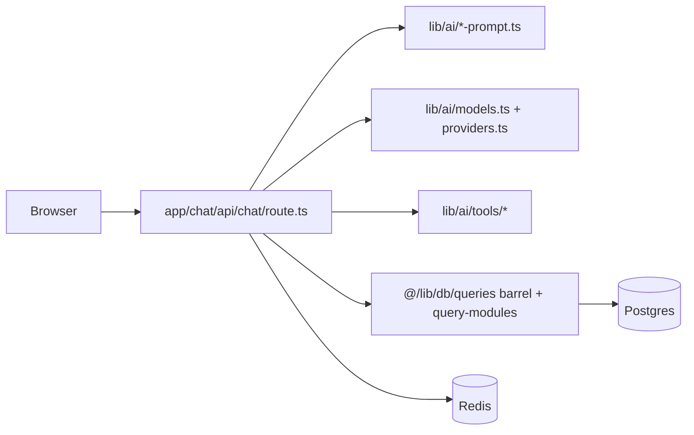

# Virgil — project management and agent entrypoint

This file is the **single entrypoint** for intent, documentation map, architecture overview, and **handoff** when starting a new Cursor chat or onboarding an agent to the repo. It does not duplicate env tables or deploy steps—those stay in linked docs.

## Intent (lightweight companion)

- **Lightweight:** Run well on 3B/7B-class local models; slim prompts; avoid extra inference calls unless they clearly pay off.
- **Affordable:** Low recurring cost by default (local Ollama, free tiers for optional cloud); gateway models are secondary.
- **Iterable:** Small, focused changes; preserve existing abstractions unless they hurt the local path; verify with `pnpm check`, tests, and AGENTS checklists.
- **Self-improvement:** The **product** (Virgil) improves via a backlog ([docs/ENHANCEMENTS.md](ENHANCEMENTS.md)), measured changes, and reviews—not unbounded autonomous edits to prompts or production behavior. The **repo** improves via the same loop plus human or agent review in Cursor.

## Where truth lives (SSOT map)

| Topic | Authoritative doc / location |
|-------|------------------------------|
| Project intent and this handoff | **This file** (`docs/PROJECT.md`) |
| Bespoke single-owner product intent (fitness v1, data tiers, voice) | [docs/OWNER_PRODUCT_VISION.md](OWNER_PRODUCT_VISION.md) |
| Optional pruning inventory (business/demo paths) | [docs/PRUNING_CANDIDATES.md](PRUNING_CANDIDATES.md) |
| Coding rules, file pointers, local-first rules, review checklists | [AGENTS.md](../AGENTS.md) |
| Traceable architecture decisions | [docs/DECISIONS.md](DECISIONS.md) |
| Security tool inventory + cron/QStash auth matrix | [docs/security/tool-inventory.md](security/tool-inventory.md) |
| Security hardening backlog (Phases A–D) | [docs/superpowers/plans/2026-03-29-security-hardening-agents.md](superpowers/plans/2026-03-29-security-hardening-agents.md) |
| Enhancement backlog (E1–E11, …) and acceptance criteria | [docs/ENHANCEMENTS.md](ENHANCEMENTS.md) |
| v2 architecture plan (June 2026 target, not in development) | [docs/V2_ARCHITECTURE.md](V2_ARCHITECTURE.md) |
| v1 → v2 migration path and what carries forward | [docs/V2_MIGRATION.md](V2_MIGRATION.md) |
| v2 evaluation data collection | [workspace/v2-eval/](../workspace/v2-eval/) |
| Itemized work tickets (E2–E7, E8-follow, Phase 4) | [docs/tickets/README.md](tickets/README.md) |
| v1 → v2 groundwork (T1–T8, two-sprint bridge) | [docs/tickets/2026-04-01-v2-groundwork-overview.md](tickets/2026-04-01-v2-groundwork-overview.md) |
| Proactive pivot (E11, phased; external prompt) | [docs/tickets/2026-04-02-proactive-pivot-epic.md](tickets/2026-04-02-proactive-pivot-epic.md), [docs/PIVOT_EVENTS_AND_NUDGES.md](PIVOT_EVENTS_AND_NUDGES.md) |
| Future monetization (issue caps, gateway limits — not personal-use phase) | [docs/tickets/future-monetization-product-opportunity-limits.md](tickets/future-monetization-product-opportunity-limits.md) |
| GitHub Issues for gateway “product opportunity” tool | [docs/github-product-opportunity.md](github-product-opportunity.md) |
| Local setup / Docker / Ollama / LAN (procedures, env table) | [AGENTS.md](../AGENTS.md) — [Setup checklist](../AGENTS.md#setup-checklist), [Deployment (production)](../AGENTS.md#deployment-production) |
| Setup / deploy link hubs (thin; discoverability only) | [SETUP.md](../SETUP.md), [DEPLOY.md](../DEPLOY.md) |
| Beta on a LAN home server (Ubuntu-first Docker stack, bundled Ollama, systemd, cold start / warmup) | [docs/beta-lan-gaming-pc.md](beta-lan-gaming-pc.md) |
| Linux 24/7 roadmap (native Ubuntu, phases 1–4: cold start → intelligence → synthesis → hardening) | [docs/VIRGIL_ROADMAP_LINUX_24_7.md](VIRGIL_ROADMAP_LINUX_24_7.md) |
| Human-friendly overview | [README.md](../README.md) |
| Optional night-review job (workspace prompts, routes) | [workspace/night/README.md](../workspace/night/README.md) |
| Packaging / desktop launcher | [packaging/README.md](../packaging/README.md) |
| Runtime behavior | **Code** (`app/`, `lib/`, etc.) |

## Architecture at a glance

- **Chat path:** Request → auth / rate limits → load chat + messages → build system prompt (companion vs front-desk, slim vs full) → trim context for local models → `streamText` with tools as configured.
- **Data:** Drizzle schema in `lib/db/schema.ts`; access via `@/lib/db/queries` (implementation under `lib/db/query-modules/`).
- **Background:** Reminders via QStash; optional digest / night-review per route docs; cron on Vercel or host—see [AGENTS.md](../AGENTS.md#scheduled-jobs-on-the-host-no-vercel-cron).

Details and file-level pointers: [AGENTS.md § Architecture Notes](../AGENTS.md#architecture-notes).

## How we improve the companion (process)

1. **Backlog:** Pick or add items in [docs/ENHANCEMENTS.md](ENHANCEMENTS.md) with realistic impact/cost.
2. **Implement:** Follow [AGENTS.md](../AGENTS.md) (focused diffs, local-first defaults, one tool per file).
3. **Verify:** `pnpm check`, `pnpm build`, targeted tests (`tests/unit/local-context.test.ts`, `pnpm ollama:smoke` when behavior touches models/Ollama).
4. **Decide:** Record meaningful tradeoffs in [docs/DECISIONS.md](DECISIONS.md) (ADR-style).
5. **Hand off:** Use the checklist below and AGENTS Review + Handoff checklists.

**Tooling:** Prefer Cursor (rules, Agent, Composer) for execution. Keep tasks scoped so the default model can complete them; split large work into steps.

**Capability escalation:** For high-risk or ambiguous work—**auth, security, schema/migrations, large refactors**—use a more capable model or explicit human review. Do not rely on a single lightweight pass for correctness.

**Boundaries:** Suggest-only flows for automated memory (e.g. night review) align with trust; production prompts and tools change through reviewed changes, not silent self-modification.

## New Cursor chat — agent handoff

**Read order**

1. This file (`docs/PROJECT.md`) — intent and map.
2. [AGENTS.md](../AGENTS.md) — how to change code safely.
3. As needed: [AGENTS.md](../AGENTS.md#setup-checklist) (env / setup / deploy detail), [docs/DECISIONS.md](DECISIONS.md) (why past choices), [docs/ENHANCEMENTS.md](ENHANCEMENTS.md) (planned work).
4. Optional: [.cursor/rules](../.cursor/rules/) for editor-specific automation.

**Capture at session start (from prior chat or human)**

- Branch name and goal of this session.
- Last verification: e.g. `pnpm check`, `pnpm build`, relevant tests.
- Open questions or blockers.

**Definition of done**

- [AGENTS.md Review Checklist](../AGENTS.md#review-checklist) and [Handoff Checklist](../AGENTS.md#handoff-checklist).
- New env vars documented per AGENTS File Conventions.
- Decisions worth remembering added or updated in [docs/DECISIONS.md](DECISIONS.md).
