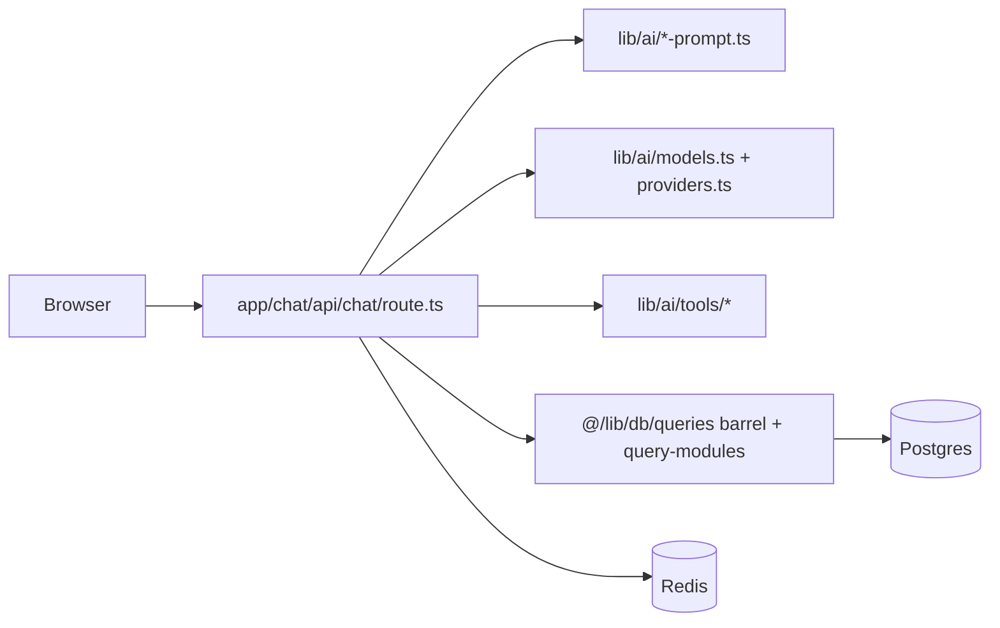

# Virgil — project management and agent entrypoint

This file is the **single entrypoint** for intent, documentation map, architecture overview, and **handoff** when starting a new Cursor chat or onboarding an agent to the repo. It does not duplicate env tables or deploy steps—those stay in linked docs.

## Intent (Ghost of Virgil — v1)

### What “Ghost of Virgil” means

Virgil is meant to feel **always available** wherever you open the app—persistent memory, scheduled jobs, and chat—but **not embodied** in the sense of a single machine or body that can touch your home, filesystem, or shell by default. On a typical **hosted** deploy, the “creature” is **state and inference in the cloud**: Postgres, optional Mem0, APIs, and the strongest **tool-capable** model path you configure. It does **not** run as root on your laptop; **corporeal** work (files, shell, LAN automations) is intentionally **delegated**—for example optional **OpenClaw** (`delegateTask`), **self-hosted** app instances that expose filesystem tools, or future bridges—rather than assumed.

**Always-on** is therefore a **composite**, not one daemon: the Vercel (or self-hosted) app and cron/QStash hooks can run continuously; **local Ollama** is on only when a host you control is up; **proactive** features (reminders, digest, night review) consume **email and queue quotas**. Effectiveness is **as high as free and hobby tiers allow**: see [free-tier-feature-map.md](free-tier-feature-map.md). When a quota or provider fails, behavior should degrade **honestly** (clear errors, slimmer tools, optional **gateway → local** retry)—not pretend unlimited reach.

**Ubiquity and context** mean: the ghost is only as informed as **you and your integrations** feed it (chat, `Memory`, calendar, health ingest, digest, night review). It should **route** work into **lanes** (inline chat vs home execution vs repo tasks) instead of trying to do everything in one overloaded turn—see [DECISIONS.md](DECISIONS.md) (Ghost of Virgil ADR) and [V2_TOOL_MAP.md](V2_TOOL_MAP.md).

### Operational bullets

- **Hosted-primary:** Default chat uses **AI Gateway / tool-capable hosted models** (`DEFAULT_CHAT_MODEL` in `lib/ai/models.ts`). Full companion tools run on that path.
- **Local resilient:** **Ollama** remains a **picker choice** and optional **gateway failure fallback**; local chat uses **slim prompts** and a **thin tool set** by design (see [docs/V2_TOOL_MAP.md](V2_TOOL_MAP.md) §1). ADR: [docs/DECISIONS.md](DECISIONS.md) (2026-04-05 Ghost of Virgil).
- **Affordable infra:** Prefer documented **free/hobby** tiers for Vercel, Neon/Supabase, Upstash, Resend, Blob; map features to quotas in [docs/free-tier-feature-map.md](free-tier-feature-map.md). **LLM spend** (Gateway / Gemini) is explicit, not hidden.
- **Iterable:** Small, focused changes; preserve abstractions unless they hurt **hosted quality** or **local resilience**; verify with `pnpm check`, tests, and AGENTS checklists.
- **Self-improvement:** The **product** (Virgil) improves via a backlog ([docs/ENHANCEMENTS.md](ENHANCEMENTS.md)), measured changes, and reviews—not unbounded autonomous edits to prompts or production behavior. The **repo** improves via the same loop plus human or agent review in Cursor.

## Target architecture (owner intent — beyond shipped v1)

Longer-term direction is scoped in **[docs/TARGET_ARCHITECTURE.md](TARGET_ARCHITECTURE.md)** (including **§2a** Interaction / Integration / Cognitive): **Virgil** (this repo) as the **brain** (UI, memory, routing, in-repo tools), a **Mac mini (~48 GB unified memory)** as the **primary home host** for Ollama and sidecars, and **[Agent Zero](https://github.com/agent0ai/agent-zero)** as the **preferred external “hands”** runtime (Python, headless)—connected later via a **planned bridge**, not shipped yet. OpenClaw remains **inspiration only** for workspace-style files (e.g. night review), not a bundled executor.

## Deployment tracks (v1 vs v2)

- **v1 (shipped):** The default **hosted** stack for this repo is **Vercel** (Next.js app) plus **Neon** Postgres, **Upstash** Redis and QStash, **Resend**, and **Vercel Blob**—aligned with free/hobby tiers and documented in [AGENTS.md](../AGENTS.md) (setup checklist and deployment table) and [docs/vercel-env-setup.md](vercel-env-setup.md). Env vars are **not** duplicated here.
- **v2 (planned):** **Mac mini** (or equivalent home host) as the primary place for **local Ollama** and the **headless Python backend** described in [docs/V2_ARCHITECTURE.md](V2_ARCHITECTURE.md), with the **Next.js UI** still able to live on Vercel and talk to that backend over a secure tunnel (see migration doc). This path **leverages hardware and open-source inference** rather than maximizing managed free tiers for the runtime.
- **v2 data layer (two valid tracks):** Operators may run **Postgres on the Mac mini (or LAN)** to preserve schema parity when migrating from v1, **or** follow the **greenfield** blueprint of **SQLite + Mem0** in [docs/V2_MIGRATION.md](V2_MIGRATION.md). The choice is an environment decision, not a single locked stack.
- **Risks that slow v2 work** are summarized in [docs/V1_V2_RISK_AUDIT.md](V1_V2_RISK_AUDIT.md); groundwork tickets **T1–T8** ([overview](tickets/2026-04-01-v2-groundwork-overview.md)) reduce reverse-engineering.

## Personal v1 scope, memory across models, and a three-device topology

**v1 product slice (personal):** Virgil is aimed at a **persistent, signed-in companion** experience for the **primary owner**—chats and optional structured memory tied to that account. This is the main “you and Virgil” loop the prompts and tools optimize for first.

**Guests:** Guest sessions are supported for lightweight use; the main product loop is the signed-in owner and persistent chats/memory.

**Memory and switching models:** Chat history and `Memory` rows in Postgres are scoped by **`userId`**, so changing the LLM (local Ollama vs AI Gateway) does not start a new identity. The system prompt loads up to **80** of the newest `Memory` rows from the last **30** days by default (`MEMORY_PROMPT_FETCH_LIMIT` / `MEMORY_PROMPT_WINDOW_DAYS` in [AGENTS.md](../AGENTS.md)); gateway models see all loaded rows in the prompt, while local slim prompts surface a smaller subset to protect small-model context. When **`MEM0_API_KEY`** is set, semantic search goes through Mem0 first; **`MEM0_MONTHLY_SEARCH_LIMIT`** (default **1000**/month, Redis-backed when `REDIS_URL` is set) caps retrieval calls and then logic falls back toward **Postgres FTS**—see [AGENTS.md](../AGENTS.md) env summary. After each completed turn, conversation text can be mirrored into Mem0 for recall later (including after **local Ollama** chats, unless you set **`MEM0_DISABLE_LOCAL_SYNC=1`** to skip Mem0 writes for local-only traffic). Gateway chat still exposes **`saveMemory` / `recallMemory`** tools; the local Ollama path stays slim (no those tools) to protect context size on small models.

**Example deployment topology:** **Phone** as the usual browser UI; **MacBook (e.g. M1 Air)** as the always-on stack (Docker Compose or `pnpm dev` + Postgres/Redis/Ollama per [AGENTS.md](../AGENTS.md)); a **LAN PC** with more RAM as a heavier Ollama **workhorse** by pointing **`OLLAMA_BASE_URL`** at that host (see [docs/beta-lan-gaming-pc.md](beta-lan-gaming-pc.md) and the LAN notes in [AGENTS.md](../AGENTS.md#setup-checklist)).

## Where truth lives (SSOT map)

| Topic | Authoritative doc / location |
|-------|------------------------------|
| Project intent and this handoff | **This file** (`docs/PROJECT.md`) |
| Bespoke single-owner product intent (fitness v1, data tiers, voice) | [docs/OWNER_PRODUCT_VISION.md](OWNER_PRODUCT_VISION.md) |
| Optional pruning inventory (historical; major business paths removed 2026-04) | [docs/PRUNING_CANDIDATES.md](PRUNING_CANDIDATES.md) |
| Target architecture (brain vs executor, hardware, device surface taxonomy, Agent Zero — **scoped intent**) | [docs/TARGET_ARCHITECTURE.md](TARGET_ARCHITECTURE.md) |
| Coding rules, file pointers, hosted-primary / resilience rules, review checklists | [AGENTS.md](../AGENTS.md) |
| Traceable architecture decisions | [docs/DECISIONS.md](DECISIONS.md) |
| Stability track (verification phases, `pnpm stable:check`) | [docs/STABILITY_TRACK.md](STABILITY_TRACK.md) — Phase B (Vercel), C (security), D (cron/QStash) runbooks; resume [docs/STABLE_STOP_HANDOFF.md](STABLE_STOP_HANDOFF.md) |
| Security tool inventory + cron/QStash auth matrix | [docs/security/tool-inventory.md](security/tool-inventory.md) |
| Security hardening backlog (Phases A–D) | [docs/superpowers/plans/2026-03-29-security-hardening-agents.md](superpowers/plans/2026-03-29-security-hardening-agents.md) |
| Exploratory long-form plans and specs | [docs/superpowers/](superpowers/) — drafts; not SSOT for shipped app behavior unless promoted elsewhere |
| Voice / persona SSOT (v1) | [docs/VIRGIL_PERSONA.md](VIRGIL_PERSONA.md); worksheet [personality/Virgil_personality_synthesis.md](personality/Virgil_personality_synthesis.md); regenerate DOCX from Markdown via [scripts/README-personality-docx.md](../scripts/README-personality-docx.md) (output is gitignored) |
| Optional phase-1 onboarding (timeline / quick start) | [QUICK_START.txt](../QUICK_START.txt), [VIRGIL_PHASE1_SETUP.md](../VIRGIL_PHASE1_SETUP.md), [VIRGIL_READY_TO_BUILD.md](../VIRGIL_READY_TO_BUILD.md) |
| Optional OpenClaw LAN execution | [openclaw-bridge.md](openclaw-bridge.md) |
| Sophon daily command center (Option B v1) | `app/(chat)/api/sophon/daily/route.ts`, `lib/sophon/`, [docs/superpowers/specs/2026-04-05-sophon-daily-command-center-design.md](superpowers/specs/2026-04-05-sophon-daily-command-center-design.md) |
| Archived Cursor prompts / pre-ship sketches | [archive/README.md](archive/README.md) |
| Enhancement backlog (E1–E11, …) and acceptance criteria | [docs/ENHANCEMENTS.md](ENHANCEMENTS.md) |
| v2 architecture plan (June 2026 target, not in development) | [docs/V2_ARCHITECTURE.md](V2_ARCHITECTURE.md) |
| v2 behavioral specs (goals, projects, schedule, briefing — SPEC, not implemented) | [docs/V2_BEHAVIORAL_SPECS.md](V2_BEHAVIORAL_SPECS.md) |
| v2 behavioral HTTP API (companion to chat contract) | [docs/V2_BEHAVIORAL_API.md](V2_BEHAVIORAL_API.md) |
| Hardware decisions (v2 host, inference tiers, retired gear) | [docs/HARDWARE.md](HARDWARE.md) |
| v1 → v2 migration path and what carries forward | [docs/V2_MIGRATION.md](V2_MIGRATION.md) |
| v2 chat / SSE / auth API contract (v1 vs Python adapter) | [docs/V2_API_CONTRACT.md](V2_API_CONTRACT.md) |
| v2 tool inventory (v1 → registry / approval / night) | [docs/V2_TOOL_MAP.md](V2_TOOL_MAP.md) |
| v1 → v2 risks (what in v1 complicates v2) | [docs/V1_V2_RISK_AUDIT.md](V1_V2_RISK_AUDIT.md) |
| v2 evaluation data collection | [workspace/v2-eval/](../workspace/v2-eval/) |
| Itemized work tickets (E2–E7, E8-follow, Phase 4) | [docs/tickets/README.md](tickets/README.md) |
| v1 → v2 groundwork (T1–T8, two-sprint bridge) | [docs/tickets/2026-04-01-v2-groundwork-overview.md](tickets/2026-04-01-v2-groundwork-overview.md) |
| Proactive pivot (E11, phased; external prompt) | [docs/tickets/2026-04-02-proactive-pivot-epic.md](tickets/2026-04-02-proactive-pivot-epic.md), [docs/PIVOT_EVENTS_AND_NUDGES.md](PIVOT_EVENTS_AND_NUDGES.md) |
| Future monetization (issue caps, gateway limits — not personal-use phase) | [docs/tickets/future-monetization-product-opportunity-limits.md](tickets/future-monetization-product-opportunity-limits.md) |
| GitHub Issues for gateway “product opportunity” tool | [docs/github-product-opportunity.md](github-product-opportunity.md) |
| Read-only Google Calendar (env OAuth, primary calendar, chat + REST) | [docs/google-calendar-integration.md](google-calendar-integration.md) |
| Free-tier quotas vs features | [docs/free-tier-feature-map.md](free-tier-feature-map.md) |
| Local setup / Docker / Ollama / LAN (procedures, env table) | [AGENTS.md](../AGENTS.md) — [Setup checklist](../AGENTS.md#setup-checklist), [Deployment (production)](../AGENTS.md#deployment-production) |
| Setup / deploy link hubs (thin; discoverability only) | [SETUP.md](../SETUP.md), [DEPLOY.md](../DEPLOY.md) |
| Beta on a LAN home server (Ubuntu-first Docker stack, bundled Ollama, systemd, cold start / warmup) | [docs/beta-lan-gaming-pc.md](beta-lan-gaming-pc.md) |
| Linux 24/7 roadmap (native Ubuntu, phases 1–4: cold start → intelligence → synthesis → hardening) | [docs/VIRGIL_ROADMAP_LINUX_24_7.md](VIRGIL_ROADMAP_LINUX_24_7.md) |
| Human-friendly overview | [README.md](../README.md) |
| Optional night-review job (workspace prompts, routes) | [workspace/night/README.md](../workspace/night/README.md) |
| Packaging / desktop launcher | [packaging/README.md](../packaging/README.md) |
| Runtime behavior | **Code** (`app/`, `lib/`, etc.) |

## Architecture at a glance

- **Chat path:** Request → auth / rate limits → load chat + messages → build system prompt (companion, slim vs full) → optional gateway planner outline → trim context for local models → `streamText` with tools as configured.
- **Data:** Drizzle schema in `lib/db/schema.ts`; access via `@/lib/db/queries` (implementation under `lib/db/query-modules/`).
- **Background:** Reminders via QStash; optional digest / night-review per route docs; cron on Vercel or host—see [AGENTS.md](../AGENTS.md#scheduled-jobs-on-the-host-no-vercel-cron).

Details and file-level pointers: [AGENTS.md § Architecture Notes](../AGENTS.md#architecture-notes).

## How we improve the companion (process)

1. **Backlog:** Pick or add items in [docs/ENHANCEMENTS.md](ENHANCEMENTS.md) with realistic impact/cost.
2. **Implement:** Follow [AGENTS.md](../AGENTS.md) (focused diffs, hosted-primary defaults, one tool per file).
3. **Verify:** `pnpm check`, `pnpm build`, targeted tests (`tests/unit/local-context.test.ts`, `tests/unit/multi-agent-orchestration.test.ts`, `pnpm ollama:smoke` when behavior touches models/Ollama).
4. **Decide:** Record meaningful tradeoffs in [docs/DECISIONS.md](DECISIONS.md) (ADR-style).
5. **Hand off:** Use the checklist below and AGENTS Review + Handoff checklists.

**Tooling:** Prefer Cursor (rules, Agent, Composer) for execution. Keep tasks scoped so the default model can complete them; split large work into steps.

**Capability escalation:** For high-risk or ambiguous work—**auth, security, schema/migrations, large refactors**—use a more capable model or explicit human review. Do not rely on a single lightweight pass for correctness.

**Boundaries:** Suggest-only flows for automated memory (e.g. night review) align with trust; production prompts and tools change through reviewed changes, not silent self-modification.

## New Cursor chat — agent handoff

**Read order**

1. This file (`docs/PROJECT.md`) — intent and map.
2. [docs/TARGET_ARCHITECTURE.md](TARGET_ARCHITECTURE.md) — **if** changing runtime topology, executor integration, or owner hardware assumptions.
3. [AGENTS.md](../AGENTS.md) — how to change code safely.
4. As needed: [AGENTS.md](../AGENTS.md#setup-checklist) (env / setup / deploy detail), [docs/DECISIONS.md](DECISIONS.md) (why past choices), [docs/ENHANCEMENTS.md](ENHANCEMENTS.md) (planned work), [docs/google-calendar-integration.md](google-calendar-integration.md) (turn on calendar + **handoff block** for the next agent).
5. Optional: [.cursor/rules](../.cursor/rules/) for editor-specific automation.

**Capture at session start (from prior chat or human)**

- Branch name and goal of this session.
- Last verification: e.g. `pnpm check`, `pnpm build`, relevant tests.
- Open questions or blockers.

**Definition of done**

- [AGENTS.md Review Checklist](../AGENTS.md#review-checklist) and [Handoff Checklist](../AGENTS.md#handoff-checklist).
- New env vars documented per AGENTS File Conventions.
- Decisions worth remembering added or updated in [docs/DECISIONS.md](DECISIONS.md).
