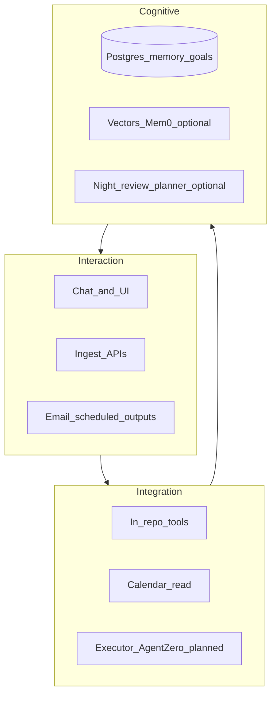
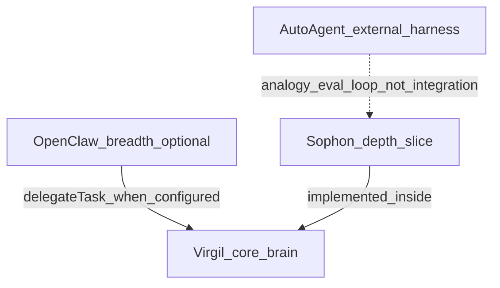
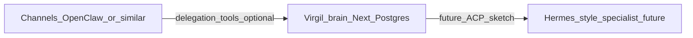

# Target architecture — Virgil “brain” + external agent executor

This document **scopes owner intent** for where the product is headed. It does **not** mean every piece below is implemented; the **shipped** stack remains the Next.js app described in [PROJECT.md](PROJECT.md) and [AGENTS.md](../AGENTS.md). Use this file so Cursor sessions and future contributors align with **hardware**, **runtime split**, and **safety gates** before code exists.

---

## 1. Hardware profile (primary home server)

- **Target machine:** Apple **Mac mini** (or equivalent always-on Mac) used as the **primary** host for this project.
- **Memory:** **48 GB unified memory** (Apple Silicon uses unified memory, not discrete “VRAM” like many GPUs). This budget supports **larger local models**, **Ollama**, and **sidecar services** (Postgres/Redis via Docker, optional Python agent) on one box without laptop thermal limits.
- **Operational goal:** The Mini is the **default** place to run **Ollama** (`OLLAMA_BASE_URL` pointing at it for LAN clients or localhost), long-running stacks, and—when built—the **executor** process below.

---

## Device surfaces (planned)

Smart home and mobile devices are **contact surfaces**—places the owner meets Virgil—not only endpoints to control. Group them by **role** so v2 can specify auth, latency, refresh cadence, and phase per channel.

| Role | Definition | Examples | Direction |
|------|------------|----------|-----------|
| **Compute node** | Runs inference or services. Not user-facing. | Mac mini (Ollama, services), Pocket Lab (heavy inference), Vercel (hosted app) | N/A |
| **Output surface** | Displays or speaks Virgil-generated content. User glances or listens; no input beyond dismiss. | Google Nest Hub (dashboard), smart speaker (TTS briefing), wall tablet (goal/calendar display), phone (ntfy push) | Virgil → device |
| **Input source** | Sends context or commands to Virgil. | Phone (chat UI, share target, ingest API), voice via STT (future), Home Assistant automations triggering `/api/ingest`, Apple Watch (health ingest) | Device → Virgil |
| **Bidirectional** | Both input and output. | Phone (chat + ntfy), Nest Hub with voice (display + STT, future), Home Assistant (sensors in, device control out) | Both |

> The v1 codebase supports input sources (chat, `/api/ingest`, `/api/health/ingest`, share target) and one output channel (Resend email via digest/reminders/night review). v2 adds ntfy as a second output channel and Home Assistant as a bidirectional surface. Voice (STT → Virgil → TTS) is a future layer that promotes speakers and hubs from output-only to bidirectional. Each surface should be specced with: auth model, latency tolerance, update frequency, and which v2 phase it ships in.

### Mobile browser (e.g. Pixel): not a local-LLM compute target

**Decision (owner scope):** The phone **does not** need to run an **on-device** LLM, and **planning must not** assume the phone has a **direct** network path to home **Ollama**. This is an explicit **non-goal** so LAN/VPN/tunnel designs are not re-litigated for “mobile local parity.” ADR: [DECISIONS.md](DECISIONS.md) (2026-04-06).

**Why:**

1. **Architecture:** Virgil chat inference is **server-side** (`streamText` on the Next.js host). The browser sends messages and a model id; it never opens `OLLAMA_BASE_URL`. The **deployment** that serves `/api/chat` must reach Ollama when you pick a local model—not the phone alone.
2. **Away from home:** A typical **Vercel** deploy cannot reach `192.168.x.x:11434`. Requiring “local LLM on the phone” to compensate would mean a **second** inference stack (tools, memory, streaming), not a small tweak.
3. **Home WiFi:** If the app is served from **Vercel**, the phone still hits the cloud origin; Ollama on the LAN is irrelevant unless you **self-host** the app on the LAN or add **controlled** remote access to that app. That is optional infra, not a phone capability.
4. **Laptop vs phone:** **Local Ollama** is for hosts where the **Next process** can use `OLLAMA_BASE_URL` (e.g. MacBook dev → Mac mini, Docker, LAN server). The **Pixel** can use **hosted** models on the same UI without breaking the home-local story on the laptop.

**If this ever changes:** Treat **native on-device** inference as a **new** product surface; document it in [DECISIONS.md](DECISIONS.md)—do not infer it from “local-first home” intent alone.

---

## 2. Two-layer model: Virgil vs Agent Zero

| Layer | Role | Technology (target) |
|-------|------|----------------------|
| **Brain / product** | Chat UI, auth, sessions, Postgres memory, reminders (QStash), gateway/Ollama routing, tools implemented in-repo, night review, agent-task queue to humans/Cursor | **Virgil** — this repository (Next.js, TypeScript) |
| **Hands / computer agent** | Rich **skills**, shell/filesystem, plugins, multi-step local automation **outside** the Next.js sandbox | **[Agent Zero](https://github.com/agent0ai/agent-zero)** (Python), run **headless** on the Mini |

**Rationale:** Virgil stays **maintainable, reviewable, and local-first**. Heavy or open-ended **computer use** belongs in a **dedicated agent runtime** (Agent Zero) rather than reimplementing the entire ecosystem inside `lib/ai/tools/`.

**OpenClaw vs bundling:** Default Compose **does not** ship OpenClaw as a service. Operators who want **breadth** (gateway-style skills, shell, messaging integrations on a LAN host) enable the **optional** HTTP bridge documented in [`openclaw-bridge.md`](openclaw-bridge.md) (`delegateTask` / `approveOpenClawIntent` when `OPENCLAW_*` is set). That is **integration**, not “Virgil embeds OpenClaw.” OpenClaw may still **inspire** patterns (e.g. workspace files under [`workspace/night/`](../workspace/night/README.md)); that is **documentation parity** beside the optional bridge.

---

## 2a. Tri-layer framing (Interaction, Integration, Cognitive)

This vocabulary describes the **same** split as §2 (Virgil brain vs Agent Zero hands), with a third axis for **where cognition and long-horizon state live**. It aligns proactive “life management” intent with **shipped** code and **ticketed** work ([E11 epic](tickets/2026-04-02-proactive-pivot-epic.md), [v2 behavioral specs](V2_BEHAVIORAL_SPECS.md)).

| Layer | Role | In Virgil today (examples) | Planned / adjacent |
|-------|------|----------------------------|--------------------|
| **Interaction** | Multi-modal **ingress** and **egress**—how the owner meets Virgil without implying all reasoning runs in the chat turn | Next.js chat UI; bearer and session ingest routes (see [AGENTS.md](../AGENTS.md) setup); share target, health ingest; email (digest, reminders, night review) | More output surfaces (e.g. ntfy) per device taxonomy above; voice STT/TTS later |
| **Integration** | **Tooling and data silos**—calendar, mail, files, automations; depth of access determines advisor vs actor | Companion tools in [`lib/ai/tools/`](../lib/ai/tools/); read-only Google Calendar; optional OpenClaw `delegateTask` | **Agent Zero** (or successor) for rich local automation; **bridge** §3; calendar **write** only behind explicit policy |
| **Cognitive** | **Persistent state**, recall, and async **reflection**—not only LLM text in a single request | Postgres (`Chat`, `Memory`, `Goal` / `GoalCheckIn` where enabled); optional Mem0 + pgvector per [DECISIONS](DECISIONS.md); night review; optional gateway planner [`lib/ai/orchestration/`](../lib/ai/orchestration/) | E11 phases (events/nudges, intent prompts, summarization); v2 **constraint-based** schedule proposals ([spike ticket](tickets/2026-04-05-scheduling-symbolic-grounding-spike.md)) |

**Engineering notes (intent vs hype):**

- **Recall:** Hybrid **FTS + optional vectors** in Postgres (and optional Mem0)—not a mandate for a separate vector-only database. See E11 and DECISIONS.
- **Scheduling / optimization:** Real systems use **bounded** constraint solvers or layered heuristics plus **human approval**—not literal enumeration of factorial task orderings.
- **Symbolic grounding:** v1 pattern is **tools + structured rows + suggest-only automation**; a dedicated rules/solver **engine** is **out of scope** for v1 and is spec’d for evaluation in the spike ticket above (likely v2 Python side).

---

## 2b. Complementary stacks: orchestration breadth vs cognitive depth

Product intent treats three ideas as **complementary**, not as a single monolith in this repo:

| Idea | Breadth vs depth | Role |
|------|------------------|------|
| **Multi-channel gateway** (e.g. [OpenClaw](https://github.com/openclaw/openclaw)) | **Breadth** | Many ingress/egress channels, skills ecosystem, team-friendly orchestration—“agent as **system** to be run.” |
| **Virgil (this repo)** | **Depth + product** | Single-owner **brain**: Postgres memory, goals, night review, chat UI, policy, hosted-primary routing—“persistent **state** and companion loop.” |
| **Hermes-style specialist** (conceptual; not a bundled product here) | **Depth (learning)** | Long-horizon **learning**: task evaluation, reusable skills, a model of how the owner works—“agent as **mind** to develop.” **Not implemented** as a separate product; Virgil’s memory and async review are general on-repo depth. The **Sophon** slice is the closest **in-repo** match for Hermes-shaped **life/task** depth (see map below). |

**Ecosystem map (how pieces relate):**

| Label | What it is | Breadth, depth, or harness | Notes |
|-------|------------|------------------------------|--------|
| **OpenClaw** | Multi-channel gateway (optional bridge) | **Breadth** | Orchestration, many surfaces, “agent as **system**.” Integrates via [`openclaw-bridge.md`](openclaw-bridge.md) when configured. |
| **Sophon** | Daily command center (`sophon/`, API route, spec) | **Depth (in Virgil)** | Priority matrix, habits, accountability, calm UX—“fits **your** work over time.” Spec: [`superpowers/specs/2026-04-05-sophon-daily-command-center-design.md`](superpowers/specs/2026-04-05-sophon-daily-command-center-design.md). **Hermes-shaped** in intent, not a separate runtime. |
| **Virgil core** | Chat, Postgres `Memory`, goals, night review, tools | **Depth + product** | Persistent companion loop; everything above hangs off this repo. |
| **AutoAgent** ([kevinrgu/autoagent](https://github.com/kevinrgu/autoagent)) | External Python repo | **Harness / meta** | Score-driven loop improves **`agent.py`** against Harbor benchmarks—not your life model. **Not bundled**; useful as a **methodology reference** only. Same *evaluated-loop shape* as “learn and keep,” different *substrate* (code vs user context). |

**ACP (Agent Communication Protocol):** Documented only as a **possible future** wire between an orchestrator (e.g. OpenClaw) and a learning specialist. **No** API surface or env vars in Virgil until an integration is explicitly designed and ADR’d.

**Agent Zero** (§2) remains the documented target for a **Python headless executor** on the home machine. **OpenClaw** (optional bridge) is a **different** integration shape (HTTP to a gateway process). Operators may use one, the other, or neither; they are not mutually exclusive by design.

**Digital Self** ([`digital-self-bridge.md`](digital-self-bridge.md)) is another **separate** orchestrator pattern (Slack/WhatsApp/SMS with approval policy). Do not conflate it with OpenClaw when reading env tables or bridges.

---

## 3. Bridge (planned, not yet first-class)

To connect the layers safely:

- **Direction:** Virgil → **authenticated** HTTP (or queue) → Agent Zero (or compatible) with **timeouts**, **payload limits**, and **no silent secrets** to the model.
- **Default posture:** **Read-only / advisory** execution unless an explicit policy allows writes (e.g. dedicated git worktree, allowlisted paths).
- **Naming:** A future tool might be described as “delegate to local executor” in code; exact API TBD in implementation ADRs.

**Today:** Optional **OpenClaw** delegation already sends work **out of process** over HTTP (see [`openclaw-bridge.md`](openclaw-bridge.md)); companion tools otherwise run **in-process** in this repo (see [security/tool-inventory.md](security/tool-inventory.md)). Until the **Agent Zero** bridge exists, there is **no** first-class Virgil → Agent Zero path—only the planned contract above.

---

## 4. “Fix itself” and “learn new skills” (policy)

These phrases are **product goals**, not permission for unchecked autonomy.

| Concept | Intended meaning | Guardrails |
|---------|------------------|------------|
| **Fix itself (the product)** | Queue improvements, bugs, refactors via **`submitAgentTask`**, GitHub issues, Cursor/human pickup | **Manual approval** before build; no auto-merge to production without review ([AGENTS.md § Agent Task Pickup Convention](../AGENTS.md#agent-task-pickup-convention)) |
| **Learn (memory)** | Preferences and facts in **Memory** / optional **Mem0**; night-review suggestions | **Suggest-only** or user-accepted writes; no silent prompt rewrites |
| **Learn (skills)** | **Versioned** skill artifacts (e.g. markdown/plugin layout compatible with Agent Zero’s skills model), reviewed like code | Lives primarily on the **executor** side or in-repo docs; not “the model free-texts a new tool into prod” |

---

## 5. Relationship to current code

- **Implemented today:** Next.js chat, Ollama + gateway models, companion tools in `lib/ai/tools/`, optional gateway planner ([`lib/ai/orchestration/`](../lib/ai/orchestration/)), Mem0, reminders, night review, agent tasks, optional **OpenClaw** HTTP delegation when configured ([`openclaw-bridge.md`](openclaw-bridge.md)).
- **Not implemented yet:** Agent Zero process, **Agent Zero** bridge routes, Hermes-style learning integration, ACP, or Mac-specific install scripts **in this repo**. Those are **follow-on** work tracked via [ENHANCEMENTS.md](ENHANCEMENTS.md) once broken into tickets.

---

## 6. When to update this doc

Update **`docs/TARGET_ARCHITECTURE.md`** when:

- The preferred executor changes (e.g. fork or alternative to Agent Zero).
- Bridge contract is chosen (auth scheme, URL shape).
- Hardware assumptions change (e.g. Linux server instead of Mini).
- The **tri-layer** mapping (§2a) or **complementarity** framing (§2b) needs to change because a new surface, store, or executor materially shifts Interaction vs Integration vs Cognitive boundaries.

Pair substantive changes with a dated entry in [DECISIONS.md](DECISIONS.md).
