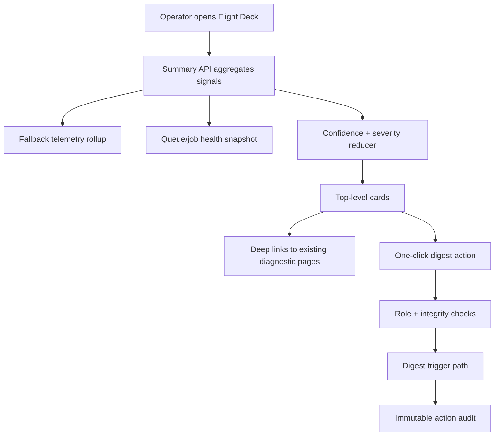

# feat: Operator flight deck incident triage MVP

## Overview

Deliver a minimal operator flight deck that speeds incident triage by surfacing the most actionable reliability signal (chat fallback/error health), one secondary signal (queue/job health), and a single guarded one-click action (manual digest run) in a top-level summary view with deep links into existing detailed pages.

## Problem Frame

Virgil has meaningful reliability diagnostics, but operators still synthesize state manually across multiple pages and docs. This slows first response during incidents. The origin requirements define a hybrid approach (minimal command surface + deep links) and strict constraints: no new external infrastructure, exactly one safe one-click action, deterministic confidence/freshness states, and auditable operator controls (see origin: `docs/brainstorms/2026-04-18-operator-flight-deck-requirements.md`).

## Requirements Trace

- R1. Top-level operator summary surface for triage-first workflows.
- R2. Primary chat fallback/error signal with per-path visibility and trend.
- R3. One adjacent signal in MVP (queue/job health), secondary to chat.
- R4. Deep links from summary cards into existing detailed pages.
- R5. Exactly one one-click safe action with strict guardrails.
- R6. Deterministic confidence/freshness and triage ordering.
- R7. Durable telemetry for flight deck cards (not file-only logs).
- R8. No new external infra/services.
- R9. Action authorization split (read vs act), auditability, and abuse controls.
- R10. Measurable incident-triage improvement outcomes.

## Scope Boundaries

- No large operator UI redesign.
- No multi-action remediation catalog in MVP.
- No autonomous self-healing actions.
- No deep historical analytics/reporting in this release.

### Deferred to Separate Tasks

- Broader adjacent signal expansion (cron health, cost anomaly cards).
- Additional one-click actions beyond manual digest run.
- Advanced cross-signal normalization engine beyond MVP deterministic rubric.

## Context & Research

### Relevant Code and Patterns

- Reliability handler pattern with structured diagnostics: `lib/reliability/digest-route-handler.ts`, `lib/reliability/night-review-enqueue-handler.ts`, `lib/reliability/job-slas-handler.ts`, `lib/reliability/background-job-run-handler.ts`.
- Existing operator-style pages/routes: `app/(chat)/background/page.tsx`, `app/(chat)/api/background/jobs/route.ts`, `app/(chat)/api/background/activity/route.ts`, `app/(chat)/api/health/route.ts`, `app/(chat)/api/delegation/health/route.ts`.
- Existing digest invocation path and auth boundary: `app/api/digest/route.ts`.
- Sidebar navigation integration pattern: `components/chat/app-sidebar.tsx`.
- Existing auth model and user schema surfaces: `app/(auth)/auth.ts`, `lib/db/schema.ts`.

### Institutional Learnings

- M4 reliability work already established structured diagnostic payloads and failure drills; flight deck should compose these rather than invent parallel telemetry (see `docs/tickets/2026-04-18-v1-1-m4-reliability-observability-hardening.md`).
- Operator runbook contains actionable recovery flow that should be linked from cards (see `docs/operator-integrations-runbook.md`).
- Stability posture requires preserving hosted-primary quality and local resilience while avoiding infra sprawl (see `AGENTS.md`, `docs/STABILITY_TRACK.md`).

### External References

- Not required for this plan; local patterns and origin requirements are sufficient for MVP scope.

## Key Technical Decisions

- **Use hybrid surface model (summary + deep links):** fast triage at top-level, detailed diagnosis in existing pages.
- **Persist fallback/error telemetry in Postgres:** durable data contract for current/trend windows without introducing external services.
- **Add explicit user role model for action auth:** implement `operator/admin` roles to satisfy read/action split and avoid allowlist drift.
- **One-click action scope is fixed to manual digest run:** highest value, bounded blast radius, existing route semantics.
- **Confidence and ordering are deterministic:** avoid model-driven summarization for incident priority logic.
- **Flight deck access model is explicit:** flight deck read and action surfaces are restricted to operator/admin roles; unauthorized access returns 403 without signal payload.

## Open Questions

### Resolved During Planning

- **RBAC source of truth for operator action auth:** add role field on user model (`operator`/`admin`) and enforce role checks in action endpoints.
- **MVP one-click action choice:** manual digest run.
- **Adjacent signal scope for MVP:** queue/job health only.

### Deferred to Implementation

- Exact telemetry table shape and rollup query details for fallback signals.
- Final stale-threshold constants after first implementation pass and targeted tests.

## High-Level Technical Design

> *This illustrates the intended approach and is directional guidance for review, not implementation specification. The implementing agent should treat it as context, not code to reproduce.*

## Implementation Units

- [ ] **Unit 1: Define flight deck data contracts and durable telemetry foundation**

**Goal:** Establish stable summary-card contracts and persistent fallback telemetry needed for current/trend windows.

**Requirements:** R2, R6, R7, R8

**Dependencies:** None

**Files:**
- Modify: `lib/db/schema.ts`
- Modify: `lib/db/queries.ts`
- Create: `lib/db/migrations/*`
- Modify: `lib/db/query-modules/*.ts` (new or extended telemetry query module)
- Create: `lib/reliability/flight-deck-signals.ts`
- Test: `tests/unit/flight-deck-signals.test.ts`

**Approach:**
- Define a minimal Postgres-backed telemetry representation for chat path outcome/error events.
- Add query helpers that return normalized signal objects with counts, freshness timestamps, and source-status metadata.
- Keep contract explicit for card rendering (`value`, `window`, `freshAt`, `confidence`, `severity`, `deepLink`, `sourceErrors[]`).

**Execution note:** Start with failing unit tests for signal rollups and freshness/confidence transitions.

**Patterns to follow:**
- `lib/reliability/digest-route-handler.ts`
- `lib/reliability/job-slas-handler.ts`

**Test scenarios:**
- Happy path: rollup returns expected counts by hosted/local/fallback paths for current/trend windows.
- Edge case: previous-window baseline is zero or sparse; trend output stays deterministic.
- Error path: one telemetry source unavailable; response marks card degraded/unknown without crashing.
- Integration: stale primary signal forces top-level status to `unknown`.

**Verification:**
- Flight deck signal module returns deterministic, typed outputs for all required card states.

- [ ] **Unit 2: Instrument chat runtime to emit durable fallback/error telemetry**

**Goal:** Ensure flight deck primary signal has reliable producers from real chat execution paths.

**Requirements:** R2, R6, R7

**Dependencies:** Unit 1

**Files:**
- Modify: `app/(chat)/api/chat/route.ts`
- Modify: `lib/ai/chat-fallback.ts`
- Modify: `lib/db/query-modules/*.ts` (telemetry write path if separated)
- Test: `tests/unit/chat-fallback-telemetry.test.ts`

**Approach:**
- Emit telemetry events for successful primary path, pre-stream fallback, and terminal failure outcomes across hosted/local/fallback paths.
- Normalize error category/codes before persistence; do not store raw sensitive payloads in card-facing error fields.
- Keep telemetry writes lightweight and failure-tolerant so chat behavior is not blocked by telemetry ingestion issues.

**Execution note:** Add characterization coverage around existing fallback behavior before adding telemetry writes.

**Patterns to follow:**
- `tests/unit/chat-fallback.test.ts`
- `tests/unit/chat-gateway-fallback-errors.test.ts`

**Test scenarios:**
- Happy path: hosted/local/fallback events are persisted with expected path labels.
- Edge case: fallback triggered pre-stream emits one consistent transition sequence.
- Error path: telemetry write failure does not break chat response path.
- Integration: persisted events are queryable by Unit 1 rollup helpers for current/trend windows.

**Verification:**
- Fallback card data can be derived from durable events emitted by real chat traffic paths.

- [ ] **Unit 3: Build summary API aggregator and deterministic prioritization**

**Goal:** Provide a single API endpoint powering the top-level flight deck summary.

**Requirements:** R1, R2, R3, R6, R7

**Dependencies:** Units 1 and 2

**Files:**
- Create: `app/(chat)/api/flight-deck/route.ts`
- Create: `lib/reliability/flight-deck-handler.ts`
- Modify: `app/(chat)/api/background/jobs/route.ts` (only if minor contract normalization is needed)
- Test: `tests/unit/flight-deck-handler.test.ts`

**Approach:**
- Implement thin route + handler pattern consistent with existing reliability APIs.
- Compose primary fallback signal plus secondary queue/job health signal.
- Apply deterministic severity ordering and confidence reduction rules in handler logic.
- Include deep-link targets and “last updated” metadata in response.
- Enforce operator/admin read authorization in both route and page data loader boundaries (no signal payload for unauthorized callers).

**Patterns to follow:**
- `app/api/digest/route.ts` + `lib/reliability/digest-route-handler.ts`
- `app/(chat)/api/delegation/health/route.ts`

**Test scenarios:**
- Happy path: response contains ordered cards with expected severity/confidence.
- Edge case: source disagreement on confidence; reducer picks deterministic result.
- Error path: one upstream source times out/fails; API still returns partial deck payload.
- Integration: top-level order remains stable across repeated calls with same input data.

**Verification:**
- Summary API produces a complete, stable contract for the UI without depending on file-based logs.

- [ ] **Unit 4: Implement top-level flight deck UI + deep-link workflow**

**Goal:** Ship the minimal operator surface and navigation integration for triage-first behavior.

**Requirements:** R1, R2, R3, R4, R6

**Dependencies:** Unit 3

**Files:**
- Create: `app/(chat)/flight-deck/page.tsx`
- Create: `app/(chat)/flight-deck/flight-deck-client.tsx`
- Modify: `components/chat/app-sidebar.tsx`
- Test: `tests/unit/flight-deck-view-model.test.ts`

**Approach:**
- Add a lightweight top-level page with summary cards only (no deep duplicated diagnostic views).
- Render required card states: `healthy`, `degraded`, `unknown`, stale, and source-unavailable.
- Ensure each card has one deterministic deep link to existing detailed routes.
- Keep visual treatment aligned with existing operator pages and accessibility patterns.
- Implement one-click interaction UX states: confirm, in-progress, success/failure, and explicit recovery hint on failure.

**Patterns to follow:**
- `app/(chat)/background/page.tsx`
- `app/(chat)/agent-tasks/agent-tasks-client.tsx`

**Test scenarios:**
- Happy path: cards render with expected values and deep-link destinations.
- Edge case: stale data state shows explicit freshness/confidence copy.
- Error path: partial API response still renders usable UI.
- Integration: keyboard navigation reaches cards/actions predictably and deep links remain valid.

**Verification:**
- Operator can go from summary to detailed diagnosis in one navigation step.

- [ ] **Unit 5: Add role-based authorization and guarded one-click digest action**

**Goal:** Deliver exactly one safe one-click action with strict access, integrity, and audit controls.

**Requirements:** R5, R8, R9

**Dependencies:** Units 3 and 4

**Files:**
- Modify: `lib/db/schema.ts`
- Modify: `lib/db/queries.ts`
- Create: `lib/db/migrations/*`
- Modify: `app/(auth)/auth.ts`
- Create: `lib/security/operator-authorization.ts`
- Create: `app/(chat)/api/flight-deck/actions/digest/route.ts`
- Create: `lib/reliability/flight-deck-actions-handler.ts`
- Create: `lib/db/query-modules/operator-audit.ts`
- Test: `tests/unit/flight-deck-actions-handler.test.ts`

**Approach:**
- Introduce user role support sufficient for `view` vs `act` boundary.
- Implement dedicated action route for manual digest run with:
  - role check,
  - same-origin/session-bound integrity validation,
  - integrity token/idempotency handling,
  - cooldown + single-flight protection,
  - immutable audit write.
- Keep cron-protected digest route behavior unchanged; action endpoint should use internal trusted invocation pattern rather than bypassing auth constraints.

**Execution note:** Implement action route test-first due security and safety sensitivity.

**Patterns to follow:**
- `app/api/digest/route.ts`
- `lib/reliability/background-job-run-handler.ts`

**Test scenarios:**
- Happy path: authorized operator triggers action once and gets success + requestId.
- Edge case: duplicate submit/replay with same idempotency key is blocked safely.
- Error path: unauthorized role is denied and audit/response are consistent.
- Integration: audit row is written for success and failure outcomes with actor/action/target.

**Verification:**
- One-click action is safe-by-default, auditable, and unavailable to unauthorized users.

- [ ] **Unit 6: Documentation, runbook mapping, and measurement readiness**

**Goal:** Ensure operators understand signals/actions and that success can be measured.

**Requirements:** R4, R9, R10

**Dependencies:** Units 3, 4, and 5

**Files:**
- Modify: `docs/operator-integrations-runbook.md`
- Modify: `docs/STABILITY_TRACK.md`
- Modify: `docs/PROJECT.md` (brief operator-surface mention if needed)
- Create: `lib/reliability/flight-deck-metrics.ts`
- Test: `tests/unit/flight-deck-metrics.test.ts`

**Approach:**
- Add a deterministic mapping from card incident states to runbook sections.
- Document action guardrails, role requirements, and expected response flows.
- Define baseline and post-launch measurement process for triage/recovery metrics, backed by explicit metrics helper outputs.

**Patterns to follow:**
- Existing failure-drill style in `docs/operator-integrations-runbook.md`.

**Test scenarios:**
- Happy path: each card incident type maps to a valid runbook target.
- Edge case: missing mapping falls back to safe generic guidance.
- Error path: docs/mapping drift detected by test or validation.
- Integration: measurement notes align with data emitted by summary/action endpoints.

**Verification:**
- Operators can follow card-to-runbook path without manual hunting and track triage improvement outcomes.

## System-Wide Impact

- **Interaction graph:** New flight deck summary API composes reliability and background signal modules; new action route invokes digest behavior through guarded internal path.
- **Error propagation:** Upstream source failures should degrade card confidence, not fail the full deck response.
- **State lifecycle risks:** stale telemetry, duplicate actions, and role-migration gaps are primary risks.
- **API surface parity:** Existing reliability routes remain source surfaces; flight deck API is additive.
- **Integration coverage:** Requires cross-layer tests for signal aggregation, action auth, and audit writes.
- **Unchanged invariants:** Cron and worker auth boundaries stay intact; no autonomous remediation introduced.

## Risks & Dependencies

| Risk | Mitigation |
|------|------------|
| Role model change introduces auth regression | Isolate role checks to flight deck action path first; preserve existing guest/regular behavior elsewhere |
| Fallback telemetry schema under-specifies trend semantics | Lock contract in Unit 1 tests before UI build |
| One-click action duplicates or replays | Enforce idempotency + cooldown + single-flight server-side |
| Partial source outages create misleading dashboard | Confidence/freshness rules force `unknown` states and explicit source-error display |

## Documentation / Operational Notes

- Update operator runbook with new flight deck card meanings and one-click action recovery path.
- Record role setup expectations for operators in deployment/setup docs if role migration is needed.
- Ensure stability docs reflect new summary and action endpoints for incident workflows.

## Sources & References

- **Origin document:** [docs/brainstorms/2026-04-18-operator-flight-deck-requirements.md](docs/brainstorms/2026-04-18-operator-flight-deck-requirements.md)
- Reliability hardening baseline: `docs/tickets/2026-04-18-v1-1-m4-reliability-observability-hardening.md`
- Operator runbook: `docs/operator-integrations-runbook.md`
- Key implementation surfaces: `lib/reliability/digest-route-handler.ts`, `app/api/digest/route.ts`, `app/(chat)/api/background/jobs/route.ts`, `components/chat/app-sidebar.tsx`
