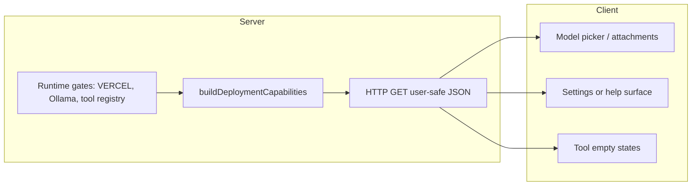

# Deployment capabilities — unified information architecture (local vs Vercel)

## Overview

Make **what this deployment can do** discoverable in the product: models, agent tool families, and major integration surfaces, with **parity of clarity** between local and Vercel—not parity of raw features. Today, behavior differs by environment (see `lib/ai/tools/companion.ts` for tool gating; Ollama discovery in `app/(chat)/api/models/route.ts`; production hides dev-oriented diagnostics in `app/api/virgil/status/route.ts`). The gap is **information architecture**, not only missing code paths.

## Problem Frame

Operators and developers switch between local and hosted deploys and experience the product as inconsistent because **capability differences are implicit** until something fails or they read `AGENTS.md`. The origin document (see `origin` above) commits to user-visible, human-readable capability surfacing with an explicit audience model (R4).

## Requirements Trace

- R1. Single coherent picture of **deployment capabilities** for this running instance (human-readable, not raw env dumps). (see origin)
- R2. **Point-of-use** clarity when a capability is absent on this deployment. (see origin)
- R3. **Parity of clarity**, not feature parity. (see origin)
- R4. Respect **who** sees detailed vs diagnostic information (end user vs owner/operator). (see origin)

## Scope Boundaries

- **Out of scope:** Making LAN Ollama or arbitrary shell available on Vercel; that remains a platform constraint unless separately prioritized.
- **Out of scope:** Replacing `docs/vercel-env-setup.md` or `AGENTS.md`; plan may add **links** from UI to those docs where appropriate.
- **In scope:** A **user-safe** capability surface suitable for production, plus optional **owner-grade** detail behind existing auth/session patterns (decision in Unit 2).

### Deferred to Separate Tasks

- Full redesign of `buildVirgilStatus` row copy for non-developer audiences (may overlap; start with a slimmer “capabilities” snapshot first).

## Context & Research

### Relevant Code and Patterns

- **Tool gating by environment:** `lib/ai/tools/companion.ts` — `localOnlyTools` omitted when `process.env.VERCEL` is set.
- **Models list and capabilities:** `app/(chat)/api/models/route.ts` merges curated + discovered Ollama models; `components/chat/multimodal-input.tsx` uses `/api/models` for picker and attachment gating.
- **Existing status snapshot (dev-oriented):** `lib/integrations/virgil-status.ts` builds `VirgilStatusSnapshot`; `app/api/virgil/status/route.ts` returns 404 in production unless `VIRGIL_EXPOSE_STATUS` is set—**product tension** with R1/R3 for hosted clarity; address via a **new** user-safe contract rather than exposing raw status to everyone.
- **Institutional docs:** `docs/vercel-env-setup.md` describes env sync; link as “how to configure” where helpful.

### Institutional Learnings

- None specific in `docs/solutions/` surfaced during planning; implementer should quick-check `docs/solutions/` for related deployment notes before shipping.

### External References

- None required for core approach; optional UX patterns for “environment capability” pages in similar devtools products.

## Key Technical Decisions

- **Separate contract from `VirgilStatusSnapshot`:** Reuse **logic** where cheap (shared env checks), but expose a **new** JSON shape optimized for “what can I use here?” with stable, UI-consumable fields—avoid repurposing the full operator status blob for all users (see feasibility in origin: production currently blocks raw status).
- **Server-derived truth:** Capabilities must be computed server-side from the same gates as runtime behavior (tools, model sources), so the UI cannot drift from reality.
- **Progressive disclosure:** Default response is **safe for any signed-in or public context** (no secrets, no raw env keys); richer diagnostics stay behind explicit operator affordances (session role, env flag, or dedicated settings) per R4—exact gate **deferred to implementation** with a short spike in Unit 2.

## Open Questions

### Resolved During Planning

- **Reuse `/api/models` vs new route?** — Extend `/api/models` with non-model fields only if it stays cache-friendly and semantically clear; otherwise prefer **`GET /api/deployment/capabilities`** (name TBD) so caching and contracts stay clean.

### Deferred to Implementation

- **Auth for owner-only sections:** Map to existing “owner” or admin patterns in the app (`components/chat/shell.tsx` already references production vs dev copy in places—align with established role checks).
- **Exact UI placement:** Settings page vs compact “About this deployment” drawer—pick the smallest surface that satisfies R2 without cluttering chat.

## High-Level Technical Design

> *This illustrates the intended approach and is directional guidance for review, not implementation specification. The implementing agent should treat it as context, not code to reproduce.*

## Implementation Units

- [x] **Unit 1: Capability builder module**

**Goal:** Centralize **user-safe** deployment capability facts derived from existing runtime gates (not duplicated string checks scattered in UI).

**Requirements:** R1, R3

**Dependencies:** None

**Files:**

- Create: `lib/deployment/capabilities.ts` (name adjustable—single place for `buildDeploymentCapabilities()` or equivalent)
- Modify: potentially export small helpers from `lib/ai/tools/companion.ts` *only if needed* to avoid duplicating `isVercel` tool lists—prefer importing existing `getCompanionToolNames` / parallel facts
- Test: `tests/unit/deployment-capabilities.test.ts` (or colocate with project convention)

**Approach:**

- Define a stable serializable type: e.g. `agentTools: { id: string; available: boolean; reason?: string }[]`, `localModels: { available: boolean; reason?: string }`, `hostedModels: { available: boolean }`, `environment: "vercel" | "local" | "other"` (exact fields deferred).
- Map **reason** strings to copy keys or short markdown-safe sentences—no secret values.
- Pull booleans from the same sources as runtime: `Boolean(process.env.VERCEL)`, Ollama reachability if already encapsulated (follow patterns from `lib/ai/ollama-discovery.ts`).

**Patterns to follow:**

- Pure functions testable without Next request context; mirror `buildVirgilStatus` structure but smaller and user-facing.

**Test scenarios:**

- **Happy path:** Local dev without `VERCEL` — local tools reported available; Ollama section reflects discovery outcome (may require mocking Ollama helpers).
- **Edge case:** `VERCEL=1` — local-only tools reported unavailable with non-empty reason.
- **Edge case:** Production-shaped env — hosted models true, local models false or “not applicable” with clear reason.

**Verification:**

- Unit tests pass; snapshot or explicit assertions on JSON shape stability for UI.

---

- [x] **Unit 2: HTTP surface for capabilities**

**Goal:** Expose capabilities JSON to the client with correct **caching and security** posture.

**Requirements:** R1, R4

**Dependencies:** Unit 1

**Files:**

- Create: `app/(chat)/api/deployment/capabilities/route.ts` (chosen path)
- Modify: none unless middleware affects new routes—verify `middleware.ts` if present
- Test: `tests/unit/` or `tests/e2e/` per repo convention for route handler (prefer unit test of handler export if pattern exists)

**Approach:**

- `GET` returns JSON from `buildDeploymentCapabilities()`.
- **Cache-Control:** short public cache or no-store depending on whether values include request-specific data; bias to **no-store** or short `max-age` if any user/session variance is later added.
- Do **not** include secrets; audit keys before merge.
- Optional: `VIRGIL_EXPOSE_STATUS`-style flag **only if** extending snapshot with operator rows—default path should need **no** extra env for basic capability JSON (R3 for hosted).

**Patterns to follow:**

- `app/(chat)/api/models/route.ts` for GET JSON + headers pattern.

**Test scenarios:**

- **Happy path:** GET returns 200 and JSON matching schema expectations.
- **Error path:** If builder throws, 500 with generic message (no stack in production)—only if applicable.

**Verification:**

- Manual: hit route locally and on preview deploy; JSON matches Unit 1 tests.

---

- [x] **Unit 3: Client consumption — settings / help surface**

**Goal:** One **obvious** place in the UI that answers “What can this deployment do?”

**Requirements:** R1, R3, R4

**Dependencies:** Unit 2

**Files:**

- Create or modify: a settings or about component under `components/` (exact path deferred—follow existing settings layout)
- Modify: relevant layout or settings entry point to link the surface

**Approach:**

- `useSWR` against the new endpoint (same pattern as `/api/models` in `components/chat/multimodal-input.tsx`).
- Render grouped sections: Agent tools, Models, Integrations (as data allows).
- Link to `docs/vercel-env-setup.md` / `AGENTS.md` anchors via stable URLs on the docs site **or** in-repo help routes if the product already hosts docs—prefer existing patterns.

**Patterns to follow:**

- SWR usage and loading states from model selector.

**Test scenarios:**

- **Integration (optional):** Playwright or RTL smoke that page renders when JSON is mocked—only if similar tests exist nearby.
- **Happy path:** Loading → success shows at least environment + one capability group.

**Verification:**

- Manual screenshot check local vs preview: both show coherent copy.

---

- [x] **Unit 4: Point-of-use hints — model picker and attachments**

**Goal:** Satisfy R2 where users already look: model selection and vision attachments.

**Requirements:** R2

**Dependencies:** Unit 2 (can ship after Unit 3 in parallel if endpoint stable)

**Files:**

- Modify: `components/chat/multimodal-input.tsx` (and any shared model-selector primitives)

**Approach:**

- When deployment capabilities indicate **no local/Ollama** on this host, show concise helper text or tooltip near local model group (e.g. “Local models require running Ollama locally; not available on this hosted deployment”).
- Reuse **facts** from capabilities endpoint rather than inferring only from empty `models` list—avoids race conditions.

**Patterns to follow:**

- Existing `isLocalModel` / curated vs dynamic entries structure in the same file.

**Test scenarios:**

- **Happy path:** Hosted deployment mock — local group shows explanatory copy; cloud models usable.
- **Edge case:** Local dev — no misleading “not available” banner.

**Verification:**

- Visual check on localhost and Vercel preview with same account.

---

- [x] **Unit 5: Documentation touchpoints**

**Goal:** Align operator docs with the new surface so support paths stay consistent.

**Requirements:** R3

**Dependencies:** Units 2–3

**Files:**

- Modify: `AGENTS.md` and/or `SETUP.md` — short pointer to in-app “deployment capabilities” and when to use `pnpm virgil:status` vs in-app UI
- Modify: `docs/vercel-env-setup.md` — one paragraph cross-link

**Approach:**

- Minimal deltas; no large rewrites.

**Test scenarios:**

- **Test expectation:** none — documentation only.

**Verification:**

- Links resolve and terminology matches UI strings.

## System-Wide Impact

- **Interaction graph:** New API route; potential SWR traffic on settings and chat shell—keep deduping intervals consistent with `/api/models`.
- **Security:** Public JSON must remain free of credentials; review for information disclosure (R4).
- **Caching:** If CDN caches aggressively, confirm JSON does not embed user-specific data without `private` cache directives.

## Risks & Mitigation

| Risk | Mitigation |
|------|------------|
| Drift between capability builder and real tool registration | Unit tests; consider deriving tool lists from `getCompanionTools` output |
| UI noise | Ship settings page first; add picker hints only if copy stays short |
| Over-exposing internals | Separate user-safe builder from `buildVirgilStatus`; audit fields |

## Test Plan Summary

- Unit tests for builder (Unit 1) are mandatory.
- Route smoke (Unit 2) as above.
- Manual cross-environment matrix: localhost, Vercel preview, production (read-only checks).

## Rollout

- Ship behind no feature flag if JSON is safe; if copy is sensitive to iteration, short internal dogfood on preview first.
