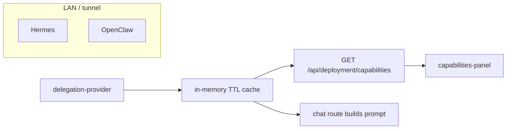

# feat: Surface Hermes/OpenClaw delegation in deployment capabilities

## Overview

Extend the **deployment capabilities** snapshot and **Deployment** page so operators can see whether **delegation** (Hermes / OpenClaw) is configured, which **primary backend** applies, whether **failover** is enabled, and **reachability** — plus a **skill catalog** with explicit **freshness** metadata. Align **operator runbooks** and **companion prompt** behavior with the same semantics (no new gateway protocols). (see origin: `docs/brainstorms/2026-04-19-hermes-openclaw-delegation-access-requirements.md`)

## Problem Frame

Operators wire `HERMES_*` / `OPENCLAW_*` and optional poll-primary (`docs/virgil-manos-delegation.md`), but `lib/deployment/capabilities.ts` only reflects **in-process** companion tools — not `delegateTask` / `embedViaDelegation`. Users cannot tell from the app if delegation works. Skill ids stay opaque unless the model hits errors. Runbook quality is load-bearing for “more tools.”

## Requirements Trace

- **R1** — Delegation status on deployment capabilities API/UI (user-safe, role assumption matches deployment page: **authenticated session** today via `app/(chat)/deployment/page.tsx`).
- **R2** — Skill id list with staleness/freshness signal; single canonical server snapshot.
- **R3** — Prompt/lane guidance consistent with snapshot; bounded call sites.
- **R4** — Keep existing `delegateTask` nullish validation and error hints (already shipped; verify no regression).
- **R5** — Explain dual-backend behavior: **resolved for this plan** — no per-intent backend pin; **primary + `delegationSendIntent` failover`** when `VIRGIL_DELEGATION_FAILOVER` allows; document clearly (origin allowed “failover only, documented”).
- **R6** — Runbook audit + links from UI; verify steps against current env names.
- **R7** — Optional stretch: short checklist — **defer** unless scoped; not required for MVP of this plan.

## Scope Boundaries

- **Not in scope:** New skills on OpenClaw/Hermes hosts, protocol changes, or Cursor-side changes.
- **Not in scope:** Per-request `delegateTask({ backend: "openclaw" })` — explicit **non-goal** for this plan; revisit in a future product decision.
- **In scope:** Virgil server, `components/deployment/capabilities-panel.tsx`, `lib/deployment/*`, `app/(chat)/api/deployment/capabilities/route.ts`, targeted prompt assembly in `app/(chat)/api/chat/route.ts` + `lib/ai/companion-prompt.ts` (or equivalent), docs (`AGENTS.md`, `docs/openclaw-bridge.md`, `docs/virgil-manos-delegation.md` as needed).

### Deferred to Separate Tasks

- **Rich skill browser** (search, descriptions beyond gateway payload) — only if gateway metadata grows; start with ids + labels if available.
- **Manual “refresh skills” button** — **shipped:** `/deployment` button + `GET /api/deployment/capabilities?refresh=1` (signed in) bypasses the TTL cache.

## Context & Research

### Relevant Code and Patterns

- `lib/integrations/delegation-provider.ts` — `getDelegationProvider`, `delegationPing`, `delegationListSkillNamesUnion`, `isDelegationConfigured`, `isDelegationFailoverEnabled`, `isDelegationPollPrimaryActive` (`lib/integrations/delegation-poll-config.ts`).
- `lib/deployment/capabilities.ts` — synchronous `buildDeploymentCapabilities()`; must evolve for async delegation probes or a **prefetch** pattern.
- `app/(chat)/api/deployment/capabilities/route.ts` — `GET` returns JSON; can be `async`.
- `components/deployment/capabilities-panel.tsx` — client SWR fetch.
- `app/(chat)/api/chat/route.ts` — `buildCompanionSystemPrompt` call sites for optional appendix injection.
- Tests: `tests/unit/deployment-capabilities.test.ts`.

### Institutional Learnings

- `docs/solutions/` not present; prior operator truth in `docs/openclaw-bridge.md`, `docs/virgil-manos-delegation.md`, `AGENTS.md`.

### External References

- Skipped — behavior is repo-specific; gateway HTTP contracts already wrapped.

## Key Technical Decisions

- **R5 resolution:** **No backend pin** in this epic; routing stays **`delegationSendIntent`** semantics (primary online → primary; else secondary when failover on). UI copy and AGENTS must **not** imply user-selectable backend per task.
- **Async capabilities build:** `GET /api/deployment/capabilities` may call `delegationPing()` and (for skills) `delegationListSkillNamesUnion()` — accept **bounded latency**; mitigate with **short TTL in-memory cache** (shared module) so repeated page loads and chat turns do not stampede gateways.
- **Staleness contract:** Response includes `skillsFetchedAt` (ISO) and `skillsFetchStatus`: `"ok" | "cached" | "unavailable"` (or similar) so R2 risk is visible.
- **Prompt alignment (R3):** Prefer **one** helper (e.g. `lib/deployment/delegation-capability-text.ts`) building a **short** operator-safe paragraph from the **same cached snapshot** used by the API, passed into `buildCompanionSystemPrompt` as an optional parameter — avoids duplicating skill lists in three places.

## Open Questions

### Resolved During Planning

- **Backend pin (R5):** None in this plan; document failover-only semantics.

### Deferred to Implementation

- **Exact TTL seconds** (e.g. 30 vs 60) — pick during implementation after measuring `delegationPing` p95 in dev.
- **Whether to show skill labels** if Hermes/OpenClaw return only ids — display ids minimally if labels absent.

## High-Level Technical Design

> *This illustrates the intended approach and is directional guidance for review, not implementation specification.*

## Implementation Units

- [x] **Unit 1: Runbook + AGENTS alignment (R6, R5)**

**Goal:** Operators have a **verified** path from env → working skills → Virgil; dual-backend semantics are documented at AGENTS level.

**Requirements:** R5, R6, success criteria (runbook current).

**Dependencies:** None.

**Files:**
- Modify: `AGENTS.md` (delegation subsection: primary vs failover, no per-task pin, pointer to deployment page)
- Modify: `docs/openclaw-bridge.md` and/or `docs/virgil-manos-delegation.md` (cross-links, troubleshooting one-liners, **no** contradiction with `delegation-provider` behavior)

**Approach:** Read `delegation-provider.ts` and `delegate-to-openclaw.ts` for exact semantics; add a **“What Virgil does”** box: configured backends, failover flag, poll-primary note. Acceptance: another contributor can trace env vars without spelunking code.

**Patterns to follow:** Existing doc tone in `docs/openclaw-bridge.md`.

**Test scenarios:**
- Test expectation: none — documentation only; **Verification:** manual checklist in PR description (operator walkthrough steps).

**Verification:** Links resolve; no stale env var names vs `delegation-provider`.

---

- [x] **Unit 2: Delegation snapshot + TTL cache module**

**Goal:** Single module exposes **user-safe** delegation metadata + cached skill ids for API and chat.

**Requirements:** R2 (staleness), DRY for R1/R3.

**Dependencies:** Unit 1 optional (can parallelize; semantics should match docs).

**Files:**
- Create: `lib/deployment/delegation-snapshot.ts` (or `lib/deployment/delegation-capabilities.ts`)
- Test: `tests/unit/delegation-snapshot.test.ts`

**Approach:** Export async `getDelegationDeploymentSnapshot()` returning: `configured`, `primaryBackend`, `failoverEnabled`, `pollPrimaryActive`, `reachable` (from `delegationPing`), `skills: string[]`, `skillsFetchedAt`, `skillsStatus`. Implement **module-level TTL** (e.g. 45–60s) for ping + list to avoid thundering herd; on failure, return last-good cache with **`skillsStatus: "cached"`** or **`unavailable`** per origin risk text.

**Patterns to follow:** Similar caching discipline to `getCachedOpenClawSkillNames` in `lib/integrations/openclaw-client.ts`.

**Test scenarios:**
- Happy path: mock `delegationPing` true + skill list returns ids → snapshot contains ids and `skillsStatus` ok.
- Edge case: second call within TTL returns cached data with appropriate status flag.
- Error path: gateway throws → degraded snapshot, no secrets leaked, non-throwing API surface.

**Verification:** Unit tests pass; snapshot usable from route and chat without duplicate HTTP calls in same tick (cache hit).

---

- [x] **Unit 3: Extend deployment capabilities API (R1, R2)**

**Goal:** JSON includes **delegation** block; route awaits async builder.

**Requirements:** R1, R2.

**Dependencies:** Unit 2.

**Files:**
- Modify: `lib/deployment/capabilities.ts` — extend `DeploymentCapabilities` type; add `buildDeploymentCapabilitiesAsync()` or merge into one async export used by route.
- Modify: `app/(chat)/api/deployment/capabilities/route.ts` — `export async function GET()`
- Modify: `tests/unit/deployment-capabilities.test.ts` — mock delegation snapshot module

**Approach:** Keep existing sync fields; add `delegation: { ... } | null` when not configured. **Never** emit raw URLs or secrets.

**Test scenarios:**
- Happy path: delegation configured (mocked) → response includes primary backend string and `reachable`.
- Edge case: delegation not configured → `delegation` null or explicit `available: false` per chosen shape.
- Integration: route returns 200 JSON with `Cache-Control: no-store` unchanged.

**Verification:** Tests green; panel still renders when delegation block absent.

---

- [x] **Unit 4: Deployment page UI (R1, R2)**

**Goal:** Operators see delegation section + skill list + **timestamp / status** for freshness.

**Requirements:** R1, R2.

**Dependencies:** Unit 3.

**Files:**
- Modify: `components/deployment/capabilities-panel.tsx`
- Optional: small presentational subcomponent for delegation block

**Approach:** New section **Delegation** with: configured yes/no, primary backend, failover on/off, reachable, poll-primary hint if active, **skills** as monospace list (truncate with “+N more” if huge), **snapshot time** and stale warning copy if `skillsStatus !== "ok"`. Add stable **`data-testid`s** for the delegation block, skill list, and stale/unavailable banner so R2 staleness is testable and not only manual.

**Patterns to follow:** Existing section spacing/typography in same file.

**Test scenarios:**
- Happy path: mocked SWR payload with `skillsStatus: "ok"` renders block (`data-testid` present).
- Edge case: `skillsStatus !== "ok"` shows warning region (assert via test id or text substring in shallow test if added).

**Verification:** Local dev: page shows delegation block when env configured.

---

- [x] **Unit 5: Companion prompt appendix (R3)**

**Goal:** When delegation tools are registered, system prompt includes **consistent** guidance + **sample skill ids** from snapshot cache (bounded length).

**Requirements:** R3.

**Dependencies:** Unit 2 (and chat route wiring).

**Files:**
- Modify: `app/(chat)/api/chat/route.ts` — prefetch snapshot when building tools / prompt
- Modify: `lib/ai/companion-prompt.ts` — optional parameter `delegationCapabilityAppendix?: string` (or compose inside route)
- Test: extend existing chat route tests if present; else `tests/unit/companion-prompt-delegation.test.ts` for pure string builder

**Approach:** Only inject when `delegateTask` / `approveDelegationIntent` / embed tools are actually in the tool list for this request — **do not** claim skills if snapshot unavailable (fallback to generic “see deployment page” line). **Wire the same appendix into every `buildCompanionSystemPrompt` call in `app/(chat)/api/chat/route.ts`** (main gateway path and **Ollama→gateway escalation** path) so prompts never drift between modes.

**Patterns to follow:** Existing delegation paragraphs in `companion-prompt.ts`; keep DRY.

**Test scenarios:**
- Happy path: appendix contains at most N skill ids and backend name when snapshot ok.
- Edge case: snapshot unavailable → short disclaimer, no fabricated ids.

**Verification:** Manual: one chat with delegation env shows appendix; without env, no appendix.

---

- [x] **Unit 6: Regression pass (R4)**

**Goal:** Confirm `delegateTask` / approval flows unchanged; **`VIRGIL_DELEGATION_STRICT_SKILLS`** error copy (`delegationUnknownSkillMessage`) remains coherent when prompt appendix lists a sampled skill set.

**Requirements:** R4, origin success criteria on strict allowlist.

**Dependencies:** Units 2–5.

**Files:**
- Modify: add or extend unit tests — e.g. new `tests/unit/delegate-task-input-schema.test.ts` importing the tool’s zod schema behavior, **or** extend `tests/unit/delegation-provider.test.ts` / existing openclaw match tests as appropriate; **do not** reference a non-existent `delegate-to-openclaw.test.ts`.
- Skim: `lib/ai/tools/delegate-to-openclaw.ts`

**Test scenarios:**
- Edge case: `skill: null` still parses (regression from prior fix).
- Happy path: unknown skill + strict mode message pattern unchanged when only messaging changes are prompt text (manual or snapshot test as available).

**Verification:** `pnpm run test:unit` passes for touched suites.

## System-Wide Impact

- **Interaction graph:** Deployment page **authenticated** only — same as today. Capabilities API: confirm whether route is public; if public, **delegation block must remain non-sensitive** (no secrets) — aligns with origin assumption.
- **Error propagation:** Skill list fetch failures must not 500 the deployment page — degrade gracefully.
- **Cache:** Shared in-memory TTL — **per server instance**; acceptable for operator snapshot; document for multi-instance deploys (eventual consistency).
- **Unchanged invariants:** `delegationSendIntent` routing logic unchanged; only observability + prompts.

## Risks & Dependencies

| Risk | Mitigation |
|------|------------|
| Stale skill list misleads users (origin R2) | Explicit `skillsFetchedAt` + status; conservative copy when `unavailable` |
| Async GET slower | TTL cache; cap skill list length in UI and prompt |
| Prompt token bloat | Cap appended skill ids (e.g. 24) with ellipsis |

## Documentation / Operational Notes

- Update `AGENTS.md` Key Decisions or delegation section when behavior ships.
- PR checklist: runbook links from deployment panel tested.

## Sources & References

- **Origin document:** [docs/brainstorms/2026-04-19-hermes-openclaw-delegation-access-requirements.md](../brainstorms/2026-04-19-hermes-openclaw-delegation-access-requirements.md)
- Related code: `lib/integrations/delegation-provider.ts`, `lib/deployment/capabilities.ts`, `components/deployment/capabilities-panel.tsx`
- Prior related plan: `docs/plans/2026-04-19-002-feat-deployment-capabilities-parity-plan.md` (inference/tools parity — extend, do not contradict)
