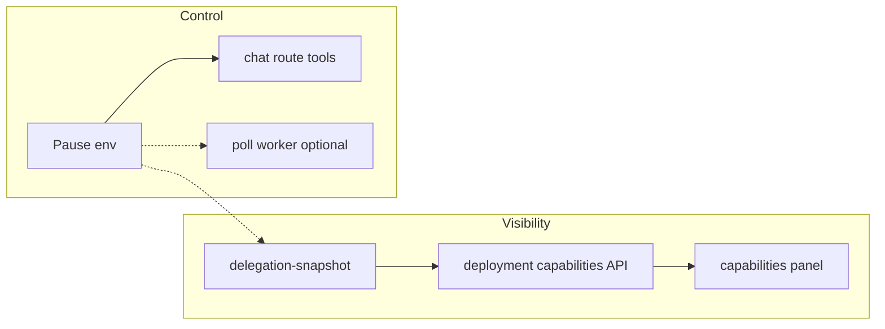

# Delegation steering for operators — visibility, runbooks, pause, insight

## Overview

The brainstorm ([origin document](docs/brainstorms/2026-04-19-hermes-openclaw-delegation-access-requirements.md)) defines **visibility**, **skill discoverability**, **honest prompts**, **runbook quality**, **operational insight**, **access clarity**, and **pause/degrade** for Hermes/OpenClaw delegation through Virgil — with **passthrough + gateway-side limits** (no competing rate/cost enforcement in Virgil) and **failover-only** routing (no per-request backend pin) (see origin: Key Decisions).

**Current codebase already covers a large slice of R1–R4 and R12:** `lib/deployment/delegation-snapshot.ts` builds a cached deployment snapshot with reachability, diagnostics, skill ids/descriptors, routing probe, and `buildDelegationCapabilityAppendix()` for prompts; `components/deployment/capabilities-panel.tsx` surfaces delegation, refresh/probe, stale-skill warnings, and routing copy; `app/(chat)/api/deployment/capabilities/route.ts` supports `?refresh=1` for signed-in users; chat registers `delegateTask` when `isDelegationConfigured()` in `app/(chat)/api/chat/route.ts`.

This plan sequences **remaining** work: **R6 runbook verification**, **R9/R11 operator copy**, **R10 pause**, **R8 insight MVP**, tests, and optional **R7** stretch.

## Problem Frame

Operators self-hosting Virgil with Hermes/OpenClaw need to **steer** delegation without guessing env combinations, **trust** what the UI and prompts claim, and **recover** when gateways drift — without Virgil duplicating OpenClaw policy or budgets (origin: split responsibility, R6, R11 alternative).

## Requirements Trace

| ID | Requirement (abbrev.) | Plan coverage |
|----|------------------------|---------------|
| R1 | Deployment surface reports delegation status, backend, failover, reachability | Mostly done — verify gating/copy in Unit 2 |
| R2 | Canonical skill list + freshness | Done — extend tests / edge cases in Unit 5 |
| R3 | Prompts from same snapshot as UI | Done — guard with tests when snapshot/appendix change |
| R4 | Robust `delegateTask` / errors | Existing tests — regression in Unit 5 if touched |
| R5 | Dual-backend explainable, no fake pin | Done in UI copy — keep in sync in Unit 2 |
| R6 | Runbooks complete + verified | Unit 1 |
| R7 | Optional delegation setup subsection | Unit 6 (stretch) |
| R8 | Post-hoc outcomes / insight | Unit 4 |
| R9 | Access policy clarity (roles vs delegation) | Unit 2 |
| R10 | Pause / degrade without redeploy lie | Unit 3 |
| R11 | Passthrough — limits on gateway | Unit 2 (copy + links) |
| R12 | UI matches runtime | Units 2–3 |

## Scope Boundaries

- **Out of scope:** New skills inside OpenClaw/Hermes repos; wire-protocol changes unless discovery proves a bug; **Virgil-enforced** budgets/concurrency (origin: rejected default).
- **In scope:** Docs, env toggles, deployment UI/API, chat tool registration gating, read-only aggregates for operators, tests.

### Deferred to Separate Tasks

- Full **in-app** delegation history UI (beyond aggregates/export) if R8 MVP proves insufficient — revisit after Unit 4.

## Context & Research

### Relevant Code and Patterns

- Delegation snapshot + cache: `lib/deployment/delegation-snapshot.ts` (`TTL_MS`, `getDelegationDeploymentSnapshot`, `buildDelegationCapabilityAppendix`).
- Capabilities payload: `lib/deployment/capabilities.ts` (`buildDeploymentCapabilities`, `delegationPollQueue`).
- UI: `components/deployment/capabilities-panel.tsx`; diagnostics JSON: `lib/deployment/build-deployment-diagnostics-payload.ts`.
- Chat tool gating: `app/(chat)/api/chat/route.ts` (`openClawPersonalEnabled`, `delegationHint`, `delegationCapabilityAppendix`).
- Provider + failover: `lib/integrations/delegation-provider.ts`.
- Pending intents (insight data): `lib/db/schema.ts` (`pendingIntent` statuses), `lib/db/query-modules/pending-intents.ts`.
- Poll worker: `lib/integrations/delegation-poll-config.ts`, worker API routes under `app/` (see grep for `delegation/worker`).

### Institutional Learnings

- No `docs/solutions/` entries matched this topic; rely on origin doc + code.

### External References

- Operator docs: `docs/openclaw-bridge.md`, `docs/virgil-manos-delegation.md`, `AGENTS.md` delegation bullets.

## Key Technical Decisions

- **Passthrough for limits (R11):** Surface honest copy that **rate/cost/concurrency** are enforced on the **gateway host**; link to OpenClaw/Hermes docs — do not add a second limiter in Virgil (origin).
- **Pause (R10):** Introduce a **single supported env** (name finalized in implementation, e.g. `VIRGIL_DELEGATION_TOOLS_DISABLED` or `VIRGIL_DELEGATION_DISABLED`) that **suppresses chat registration** of delegation tools and sets **snapshot + prompts** to “paused” semantics — spike worker/poll behavior so the deployment does not claim “on” while chat has no tools (half-truth). Queued rows: document whether worker still drains or pauses claiming; prefer **document + minimal code** if full drain semantics are risky.
- **Insight MVP (R8):** Prefer **extending diagnostics export** (clipboard JSON) or deployment capabilities with **aggregates** (counts by `PendingIntent.status` for last N hours / totals) **without PII** in the default export — signed-in operators only, same trust tier as capabilities refresh.

## Open Questions

### Resolved During Planning

- **Backend pin (R5):** Failover-only — already documented in origin; UI must continue to state no per-message switch.
- **Steering stance (R9–R11):** Passthrough — recorded in origin.

### Deferred to Implementation

- Exact **env name** for pause and whether poll worker must short-circuit `claim` — spike in Unit 3.
- Whether R8 aggregates need **migration** or only read existing `PendingIntent` — confirm query cost on large tables (index/filter by `createdAt`).

## High-Level Technical Design

> *This illustrates the intended approach and is directional guidance for review, not implementation specification.*

Pause should flow: env read in one helper (e.g. `isDelegationChatToolsEnabled()`) used by chat route, snapshot builder, and companion prompt hint so **R12** holds.

## Implementation Units

- [x] **Unit 1: Runbook audit and doc drift (R6)**

**Goal:** Canonical operator path from zero → working skills → Virgil sees them; troubleshooting matches current env names and flows.

**Requirements:** R6, success criteria “runbook kept current”.

**Dependencies:** None.

**Files:**
- Modify: `docs/openclaw-bridge.md`, `docs/virgil-manos-delegation.md` (and cross-links from `DOCUMENTATION_INDEX.md` if needed)
- Modify: `.env.example` (delegation section comments only if drift found)
- Modify: `AGENTS.md` only if env table or flows contradict code
- Test: `Test expectation: none -- documentation verification checklist in Verification`

**Approach:**
- Walk through runbook steps against `lib/integrations/*-config.ts` and `delegation-provider.ts` for env names.
- Add or tighten a **Troubleshooting** subsection (symptom → check → doc anchor).
- Ensure panel links (`capabilities-panel.tsx`) match headings.

**Test scenarios:**
- N/A (manual verification); list expected checks in Verification.

**Verification:**
- A second developer can follow runbooks without hitting renamed env vars; `pnpm virgil:status` / deployment panel story is consistent with prose.

---

- [x] **Unit 2: Access, passthrough limits, and routing honesty copy (R9, R11, R1, R12)**

**Goal:** Explicit **who sees deployment capabilities** vs chat; **no implication** of per-user skill RBAC beyond existing gates; **gateway owns limits**.

**Requirements:** R9, R11, R1 (role clarity), R12.

**Dependencies:** Unit 1 optional (can parallelize).

**Files:**
- Modify: `AGENTS.md` (short “Delegation access” bullet: deployment page assumptions, chat tools same as session owner)
- Modify: `components/deployment/capabilities-panel.tsx` (footnote: limits/rate on gateway; link to `docs/openclaw-bridge.md` or external OpenClaw docs)
- Modify: `app/(deployment)/deployment/page.tsx` or wrapper only if a one-line intro is needed
- Test: `tests/unit/deployment-capabilities-panel-probe.test.ts` or new lightweight test if copy/constants move to a shared string helper

**Approach:**
- Document that **delegation tools follow the same chat session** as other tools (owner/single-tenant assumptions per product intent); deployment UI is **operator-facing** where the app exposes it.
- Add **one** paragraph on **passthrough**: Virgil does not enforce OpenClaw-side tool policy beyond documented env (`VIRGIL_DELEGATION_STRICT_SKILLS`, etc.).

**Test scenarios:**
- **Happy path:** Panel still renders delegation block when `data.delegation` present (existing tests).
- **Edge case:** If delegation unconfigured, new copy does not reference limits confusingly.

**Verification:**
- Product/legal tone matches single-owner posture; no new secret leakage.

---

- [x] **Unit 3: Delegation pause / degrade (R10, R12)**

**Goal:** Operators can **disable delegation tools in chat** via env without redeploying code; deployment snapshot and prompts **reflect paused** state; no “tools registered but paused” inconsistency.

**Requirements:** R10, R12, R4 (errors remain sensible).

**Dependencies:** Prefer completing Unit 2 for copy alignment.

**Files:**
- Create or modify: small helper in `lib/integrations/` (e.g. `delegation-chat-gate.ts`) consumed by `app/(chat)/api/chat/route.ts`, `lib/deployment/delegation-snapshot.ts` (or capabilities), `lib/ai/companion-prompt.ts` / lanes if `delegationHint` needs `paused: true`
- Modify: `app/(chat)/api/chat/route.ts` — gate `openClawToolsBlock` on configured **and** not paused
- Modify: poll worker claim path if spike shows claims must stop (`app/**/delegation/worker/**` or `lib/` handlers)
- Modify: `.env.example`, `AGENTS.md` env table
- Test: `tests/unit/` new file for gate helper + chat route tool list behavior (mock env)

**Approach:**
- Single helper: `isDelegationConfigured() && !isDelegationPaused()` (names illustrative).
- Snapshot: include `delegationPaused: boolean` or fold into `configured` + message — avoid implying gateway is down when operator intentionally paused.
- Companion prompt: when paused, `delegationHint` should match “tools absent” or explicit paused line (align with `buildCompanionSystemPrompt` and `buildVirgilLaneGuidanceBlock`).

**Test scenarios:**
- **Happy path:** Paused env → `delegateTask` not in merged tools; snapshot shows paused.
- **Edge case:** Unpaused → unchanged from today.
- **Error path:** User tries legacy client with tool call — existing validation still returns clear error if any path remains.
- **Integration:** Optional route test that capabilities JSON includes paused flag when env set.

**Verification:**
- Manual: toggle env, reload deployment page and start chat — model does not see delegation tools when paused.

---

- [x] **Unit 4: Operational insight MVP (R8)**

**Goal:** Operators can answer **what failed / backlog shape** without raw PII — at minimum via **diagnostics JSON** and/or capabilities fields.

**Requirements:** R8 (MVP), success criteria “post-hoc answerable”.

**Dependencies:** Unit 3 if aggregates should distinguish paused vs failed.

**Files:**
- Modify: `lib/deployment/build-deployment-diagnostics-payload.ts` and/or `lib/deployment/capabilities.ts`
- Modify: `lib/db/query-modules/pending-intents.ts` (aggregate query helpers)
- Modify: `components/deployment/capabilities-panel.tsx` (optional compact summary)
- Test: `tests/unit/build-deployment-diagnostics-payload.test.ts`, new tests for aggregate shape

**Approach:**
- Add **aggregates**: counts by status (and optionally `awaitingPollWorker`) for a bounded time window or last N rows — **no** full intent bodies in JSON by default.
- Gate **signed-in** or operator-only consistent with `refresh=1` auth on capabilities (follow existing auth pattern).
- If DB query is heavy, cache with snapshot TTL or compute only on refresh.

**Test scenarios:**
- **Happy path:** Mock DB returns counts; payload includes stable keys.
- **Edge case:** Empty table → zeros.
- **Error path:** DB failure → diagnostics omit aggregates or mark unavailable without crashing.

**Verification:**
- Security review: JSON paste from “Copy diagnostics” contains no secrets and minimal PII (user ids optional omit).

---

- [x] **Unit 5: Tests and regression hardening (R2, R3, R4)**

**Goal:** Staleness, refresh auth, and appendix alignment are **test-covered** so future edits do not violate R2/R3.

**Requirements:** R2 risk (staleness), R4.

**Dependencies:** Units 3–4 as they add fields.

**Files:**
- Modify: `tests/unit/deployment-capabilities.test.ts`, `tests/unit/deployment-capabilities-panel-probe.test.ts`, `tests/unit/build-deployment-diagnostics-payload.test.ts`
- Add: tests for `buildDelegationCapabilityAppendix` when `skillsStatus === "cached"` (if not present)

**Approach:**
- Characterize current `skillsStatus` and diagnostics codes.
- API route: `refresh=1` without session → 401 (already specified in route comment — assert).

**Test scenarios:**
- **Error path:** Unauthorized refresh.
- **Edge case:** Cached skills — appendix contains “stale” wording (see `delegation-snapshot.ts`).

**Verification:**
- CI green; coverage on new branches from Units 3–4.

---

- [x] **Unit 6 (stretch): Delegation setup checklist (R7)**

**Goal:** Short env checklist in deployment area **without** embedding secrets — links only.

**Requirements:** R7 optional.

**Dependencies:** Unit 1 for correct env names.

**Files:**
- Modify: `components/deployment/capabilities-panel.tsx` or `app/(chat)/deployment/page.tsx`

**Approach:**
- Collapsible “Setup checklist” bullet list mirroring `.env.example` tier-1 delegation.

**Test scenarios:**
- **Happy path:** Section renders when delegation block visible or always (product choice).

**Verification:**
- No secret values; only env key names and links.

## System-Wide Impact

- **Interaction graph:** Chat tool registration, deployment capabilities API, companion system prompt, optional worker claim path, diagnostics clipboard.
- **Error propagation:** Paused state must not surface as generic 500s; delegation tools absent should mirror “not configured” messaging where appropriate.
- **State lifecycle risks:** Pending intents when pausing — document whether worker drains; avoid duplicate sends on resume.
- **API surface parity:** Local vs Vercel — same pause semantics.
- **Unchanged invariants:** `delegationSendIntent` routing/failover logic unless pause explicitly short-circuits before send.

## Risks & Dependencies

| Risk | Mitigation |
|------|------------|
| Pause stops chat but worker keeps claiming | Spike in Unit 3; document or gate worker |
| R8 aggregates expensive on large `PendingIntent` | Time-bounded query + index review; optional refresh-only |
| Prompt/tool mismatch (R12) | Single helper for “delegation active for chat” |

## Documentation / Operational Notes

- Update env table in `AGENTS.md` and `.env.example` for pause + any new diagnostics fields.
- Changelog or `docs/STABILITY_TRACK.md` only if this repo tracks operator-visible changes there (light touch).

## Sources & References

- **Origin document:** [docs/brainstorms/2026-04-19-hermes-openclaw-delegation-access-requirements.md](docs/brainstorms/2026-04-19-hermes-openclaw-delegation-access-requirements.md)
- Related code: `lib/deployment/delegation-snapshot.ts`, `app/(chat)/api/chat/route.ts`, `lib/integrations/delegation-provider.ts`
- Docs: `docs/openclaw-bridge.md`, `docs/virgil-manos-delegation.md`
