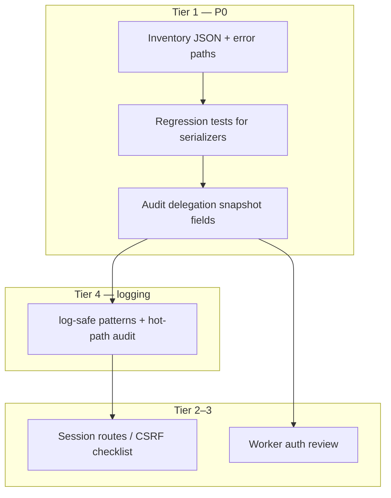

# Security hardening — confidentiality-first (threat backlog)

## Overview

The origin document ([requirements](docs/brainstorms/2026-04-20-security-hardening-threat-model-requirements.md)) defines an **end-to-end security backlog** with **secret and PII leakage prevention** as **Tier 1**. This plan sequences **how** to execute that tier in Virgil without duplicating delegation feature work ([delegation steering plan](docs/plans/2026-04-20-003-feat-delegation-steering-operators-plan.md)) — security constraints **apply to** those features but are tracked here when they are **cross-cutting**.

**Existing anchors:** User-safe deployment diagnostics (`lib/deployment/build-deployment-diagnostics-payload.ts`), structured delegation outcomes (`lib/integrations/delegation-errors.ts`), and production-safe chat logging (`lib/security/log-safe-error.ts`). Planning extends **enforcement** (tests + audits), not just comments.

## Problem Frame

Operators and owners rely on **exports, UI, and logs** for troubleshooting. Any leak of **tokens, shared secrets, raw env values, or unintended PII** undermines trust and increases incident cost. The goal is **observability without disclosure** (origin: inversion note).

## Requirements Trace

| ID | Requirement (abbrev.) | Plan coverage |
|----|------------------------|---------------|
| R1 | Operator exports / JSON — no raw secrets or env | Units 1–2 |
| R2 | API/chat errors — no secret-bearing fragments | Units 1, 3 |
| R3 | PII boundary for new observability | Unit 1 (gates), coordination with delegation R8 |
| R4 | Session-bound sensitive reads/mutations | Unit 5 |
| R5 | CSRF / browser API semantics | Unit 5 |
| R6 | Delegation passthrough honesty | Unit 3 (no raw upstream in tool/API surfaces) |
| R7 | Worker secrets server-only; avoid side-channel leaks in messages | Units 4–5 |
| R8 | Dependency / CI hygiene | Unit 6 |
| R9 | Operational logging defaults | Unit 4 |

## Scope Boundaries

- **In scope:** Virgil repo **serialization paths**, **error strings**, **logging** on server routes, **worker auth** review, **CI/lockfile** process alignment with `AGENTS.md`.
- **Out of scope:** Formal certification; **gateway repo** hardening (document-only unless wire contract changes).
- **Coordination:** When [delegation steering plan](docs/plans/2026-04-20-003-feat-delegation-steering-operators-plan.md) adds insight exports, **this plan’s R1/R3** checks must pass before merge.

## Context & Research

### Relevant Code and Patterns

- Diagnostics export: `lib/deployment/build-deployment-diagnostics-payload.ts`, tests in `tests/unit/build-deployment-diagnostics-payload.test.ts`.
- Capabilities API: `app/(chat)/api/deployment/capabilities/route.ts`, builder `lib/deployment/capabilities.ts`.
- Delegation snapshot (rich probe): `lib/deployment/delegation-snapshot.ts` — verify `delegationProbe` and related fields contain **only** user-safe strings (origin deferred question).
- Delegation errors: `lib/integrations/delegation-errors.ts` — prefer **codes + curated messages** over raw upstream text in user-visible paths.
- Chat logging: `lib/security/log-safe-error.ts`, `lib/errors.ts`.
- Worker routes: `app/api/delegation/worker/claim/route.ts`, `app/api/delegation/worker/complete/route.ts`; auth `lib/api/delegation-worker-auth.ts`.

### Institutional Learnings

- No matching entries in `docs/solutions/` for this topic.

### External Research

- **Skipped for Tier 1** — local patterns suffice; optional OWASP logging cheat sheet during Unit 4 if gaps appear.

## Key Technical Decisions

- **Test-first for Tier 1:** Add **regression tests** that fail if known **secret-shaped** substrings appear in serialized diagnostics/capabilities fixtures (exact patterns TBD in implementation — e.g. `Bearer `, `://` with embedded `@`, 32+ char hex tokens where inappropriate).
- **Central list of “forbidden in exports”:** Short checklist in-repo (e.g. `docs/` or comment block next to `buildDeploymentDiagnosticsPayload`) maintained alongside the serializer — not a separate security doc unless the team wants it later.
- **Worker auth:** Evaluate **constant-time** comparison for `Authorization: Bearer` in `unauthorizedUnlessDelegationWorker` as a **small follow-up** if review shows timing concern (R7) — not a default dependency upgrade.

## Open Questions

### Resolved During Planning

- **Ordering:** Tier 1 (R1–R2) → Tier 4 logging (R9) → Tier 2–3 (R4–R7) in same release cycle when touching those files.

### Deferred to Implementation

- Whether `delegationProbe` / routing trace strings can ever include **URLs with embedded credentials** — verify against live failure fixtures ([origin R1][Technical]).
- Whether any **fetch** path still surfaces `response.text()` to users on delegation errors — grep during Unit 3.

## High-Level Technical Design

## Implementation Units

### Unit 1 — Inventory operator-visible and support-facing payloads

**Goal:** Enumerate every path that returns **JSON to browsers** or **copy-to-clipboard exports** for operators, plus delegation **tool outcomes** surfaced in chat.

**Primary files / areas:** `lib/deployment/`, `app/(chat)/api/deployment/`, `components/deployment/capabilities-panel.tsx`, `lib/integrations/delegation-*.ts`, chat route tool plumbing.

**Deliverable:** Short table in the PR description or a comment block listing **route → serializer** — no code behavior change required if inventory is clean.

**Test scenarios:** N/A (documentation artifact); optional smoke: `pnpm test` unchanged.

---

### Unit 2 — Harden diagnostics and capabilities tests (R1)

**Goal:** Extend `tests/unit/build-deployment-diagnostics-payload.test.ts` (and related capability tests) so that **representative malicious fixtures** cannot slip secret-shaped strings into exported JSON. Prefer testing **builders** and **snapshot shape**, not scraping the whole repo.

**Primary files:** `tests/unit/build-deployment-diagnostics-payload.test.ts`, `tests/unit/deployment-capabilities.test.ts`, `lib/deployment/build-deployment-diagnostics-payload.ts` (only if a real gap is found).

**Test scenarios:**

- Export payload **never** contains a synthetic `Authorization` / `Bearer ` / full `postgres://user:pass@` style string when such data is present in internal inputs (use **constructed** bad inputs in test doubles).
- `delegationHealth` and `delegationSnapshot` fields remain **absent of raw bridge URLs** if those URLs could contain secrets (assert keys and sample values from fixtures in `tests/unit/delegation-snapshot.test.ts` if extended).

---

### Unit 3 — Sanitize delegation-facing errors for chat and APIs (R2, R6)

**Goal:** Confirm **no code path** returns raw HTTP bodies or upstream stack text to **end users** for delegation. Structured failures should flow through `lib/integrations/delegation-errors.ts` (or equivalent) with **stable codes**.

**Primary files:** `lib/integrations/delegation-provider.ts`, `lib/integrations/delegation-pending-route.ts`, `lib/integrations/delegation-preflight.ts`, tool handlers in `lib/ai/tools/`.

**Test scenarios:**

- Simulated upstream **500** with HTML body does not appear verbatim in tool `message` / API JSON.
- Known offline / timeout paths still return **curated** `DelegationFailure.message` text.

---

### Unit 4 — Logging redaction audit (R9, R7)

**Goal:** Audit **server** `console.error` / logging on paths that touch **auth**, **delegation**, **chat**, **ingest**. Align with `logChatApiException` behavior; avoid logging **full** request headers or bodies.

**Primary files:** `lib/security/log-safe-error.ts`, `lib/errors.ts`, `app/(chat)/api/chat/route.ts` (and grep hits from inventory).

**Test scenarios:**

- Manual or unit characterization: production branch of `logChatApiException` does not log **stack** (already true — regression if changed).
- No new logs print `Authorization` header values.

---

### Unit 5 — Session routes and worker boundary review (R4, R5, R7)

**Goal:** Checklist pass on **delegation worker** and **session-gated** capabilities refresh: **401/403** behavior, **no secret** in error JSON, optional **timing-safe** bearer compare.

**Primary files:** `lib/api/delegation-worker-auth.ts`, `app/(chat)/api/deployment/capabilities/route.ts`, `middleware.ts` / `proxy.ts` if cookies involved.

**Test scenarios:**

- Wrong bearer → `401` with **no** substring of the correct secret in body.
- `refresh=1` without session → `401` with stable message (already documented in route).

---

### Unit 6 — CI and dependency hygiene (R8)

**Goal:** Confirm **lockfile** and **CI security steps** match `AGENTS.md` / existing workflows; no downgrades without review.

**Primary files:** `package.json`, `pnpm-lock.yaml`, `.github/workflows/` (as applicable).

**Test scenarios:**

- CI still runs **lint/test** on PR; document any new security script if added.

## Verification

- `pnpm test` (or scoped unit tests for touched areas).
- Manual: export diagnostics from **Deployment** UI and visually confirm **note** + absence of secret-like strings.
- Optional: run `pnpm stable:check` if workflow touches stability-sensitive paths.

## Dependencies & Sequencing

1. Unit 1 → informs scope of 2–4.
2. Units 2–3 can parallelize after 1.
3. Unit 4 after 3 (fewer moving parts when error paths settle).
4. Unit 5 after 3–4 or in parallel if reviewers available.
5. Unit 6 last or ongoing — low coupling.

## Rollback / Risk

- **Low risk** if changes are **tests + audits**; **medium** if touching **error strings** consumed by automation — note any **message** changes in PR for operators.
