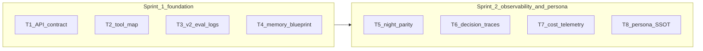

# V2 groundwork — two-sprint bridge (v1 → v2 alignment)

**Status:** Ready to execute (2026-04-01)  
**Related:** [docs/V2_MIGRATION.md](../V2_MIGRATION.md), [docs/V2_ARCHITECTURE.md](../V2_ARCHITECTURE.md), [workspace/v2-eval/](../../workspace/v2-eval/)  
**Enhancement row:** E10 in [ENHANCEMENTS.md](../ENHANCEMENTS.md)

## Why this exists

v2 assumes a **split stack**: Next.js UI + Python FastAPI backend with tools, night mode, budget traces, and a portable persona. v1 already owns chat, tools, memory, night review, and agent tasks—but those pieces are not yet **packaged** as migration-ready contracts, telemetry, and docs.

These tickets make **each v1 sprint produce artifacts** the Python backend (or migration scripts) can consume without reverse-engineering `route.ts`.

## Sprint map

**Sprint 1 (foundation):** contracts and inventories so v2 API and memory design are concrete.

| Ticket | File | Outcome |
|--------|------|---------|
| T1 | [2026-04-01-v2-t1-api-contract-for-python-backend.md](2026-04-01-v2-t1-api-contract-for-python-backend.md) | `docs/V2_API_CONTRACT.md` — chat/SSE/auth/errors vs current Next behavior |
| T2 | [2026-04-01-v2-t2-tool-inventory-and-v2-mapping.md](2026-04-01-v2-t2-tool-inventory-and-v2-mapping.md) | `docs/V2_TOOL_MAP.md` — every v1 tool → v2 registry fields (approval, local/gateway) |
| T3 | [2026-04-01-v2-t3-v2-eval-chat-instrumentation.md](2026-04-01-v2-t3-v2-eval-chat-instrumentation.md) | Wire + extend `logInteraction`; stable JSONL for routing/tool analysis |
| T4 | [2026-04-01-v2-t4-memory-migration-blueprint.md](2026-04-01-v2-t4-memory-migration-blueprint.md) | `docs/V2_MEMORY_MIGRATION.md` — schema, kinds, metadata, export strategy |

**Sprint 2 (observability + persona):** parity docs and logs that match v2 night/traces/budget/persona plans.

| Ticket | File | Outcome |
|--------|------|---------|
| T5 | [2026-04-01-v2-t5-night-agent-task-v2-parity-matrix.md](2026-04-01-v2-t5-night-agent-task-v2-parity-matrix.md) | `docs/V2_NIGHT_PARITY.md` — night review / digest / agent triage vs v2 night tasks |
| T6 | [2026-04-01-v2-t6-decision-trace-jsonl.md](2026-04-01-v2-t6-decision-trace-jsonl.md) | Optional `V2_TRACE_LOGGING` JSONL aligned to v2 trace shape |
| T7 | [2026-04-01-v2-t7-gateway-cost-telemetry.md](2026-04-01-v2-t7-gateway-cost-telemetry.md) | Document + optional log of token usage for gateway path (budget calibration) |
| T8 | [2026-04-01-v2-t8-persona-ssot-apply-workbook.md](2026-04-01-v2-t8-persona-ssot-apply-workbook.md) | `docs/VIRGIL_PERSONA.md` + prompt code sync **after** personality workbook is filled |

## Dependencies

- **T8** blocks on **human**: completed [docs/personality/Virgil_personality_synthesis.md](../personality/Virgil_personality_synthesis.md) worksheet (or explicit “use current code as SSOT” decision).
- **T6/T7** are easier if **T3** lands first (shared patterns for opt-in JSONL under `workspace/v2-eval/`).
- **T1** and **T2** can start in parallel.

## Definition of done (program level)

- All eight tickets either **merged** or explicitly **deferred** with a one-line reason in this file.
- `pnpm check` / `pnpm build` green after code-changing tickets (T3, T6, T7).
- [docs/tickets/README.md](README.md) lists this overview and T1–T8.

## Delegation

Pick one ticket per agent session; update ticket **Status** line when starting/done. Prefer T1+T2 early—they unblock backend design reviews without touching hot paths.
